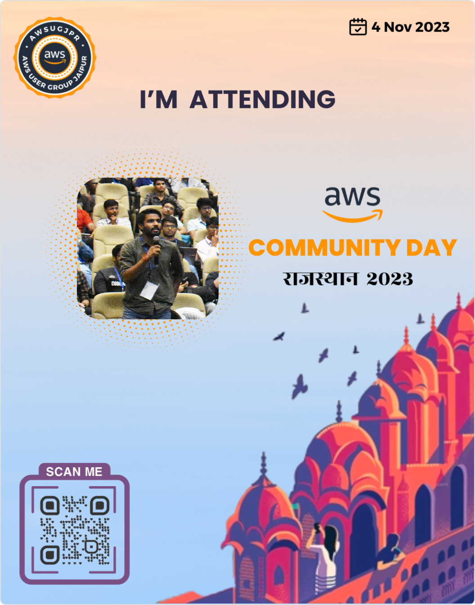
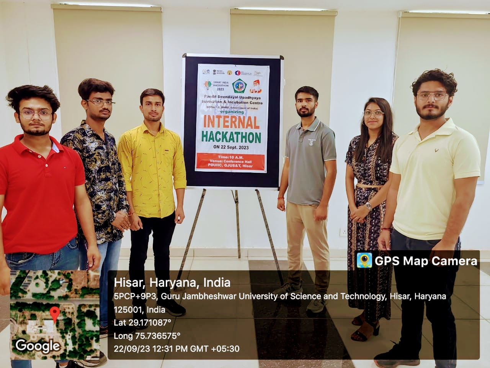


Hello 👋, I'm Harish


I'm Harish, a DevOps Engineer with a deep-rooted commitment to enhancing software development and deployment practices. My daily toolkit comprises AWS, Docker, Ansible, Terraform, and Jenkins, allowing me to orchestrate and automate the software delivery pipeline efficiently. Linux serves as the foundation of my daily operations in the DevOps realm, offering robust stability and flexibility. Additionally, I'm well-versed in vital tools like Git, GitHub, Vim, and shell scripting.

Before embracing the DevOps path, I excelled as a Native Android Developer. My skill set encompassed Kotlin, Jetpack libraries, Jetpack Compose, XML, Retrofit, and Dependency Injection with Hilt. My tech journey initiated with web development, providing me with a holistic perspective on software engineering.

I approach each project with a continuous learning mindset and a genuine passion for tackling intricate technical challenges. Let's collaborate to drive your technology initiatives forward, leveraging the right tools for the job.

## Developer Profile
- [Github](https://github.com/harisheoran)

---
## 🛠 Technology and tools
<!DOCTYPE html>
<html lang="en">
  <head>
    <meta charset="UTF-8">
    <meta name="viewport" content="width=device-width, initial-scale=1.0">
    <meta http-equiv="X-UA-Compatible" content="ie=edge">
    <title>HTML 5 Boilerplate</title>
    <link rel="stylesheet" href="https://cdn.jsdelivr.net/gh/devicons/devicon@v2.15.1/devicon.min.css">
  </head>
  <body>
  

        
        
        
        
        
        
        
        
        
        
        
        
        
        
        
        
        

  </body>
</html>

----

## Journey





  




{{< carousel images="{img/apiday01.JPG, img/apiday02.JPG}" >}}





  




Build a A.I. powered Slack Bot

  




