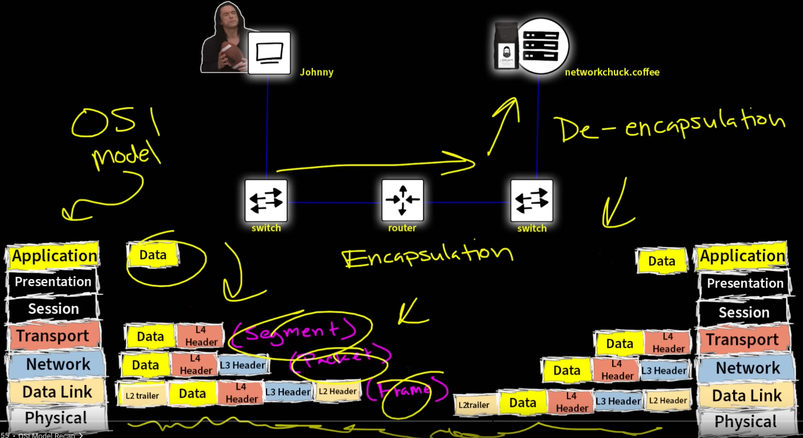
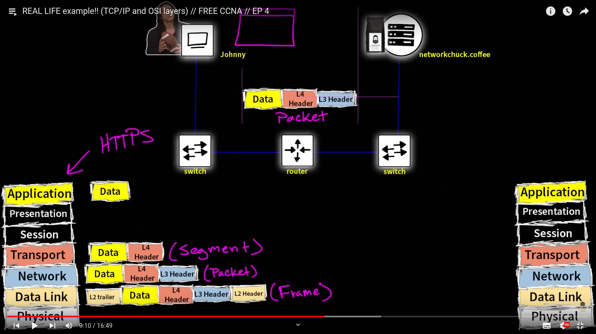

- Ethernet: Layer 1 physical layer.
- Switch: Layer 2 Device, can only read MAC address.
- Router: Layer 3 Device, can read IP address.
- Frame: message of package of Layer 1 and 2.
- Packet: message of package of Layer 1, 2 and 3.
- Gateway: Another word for Router.

### Layers

