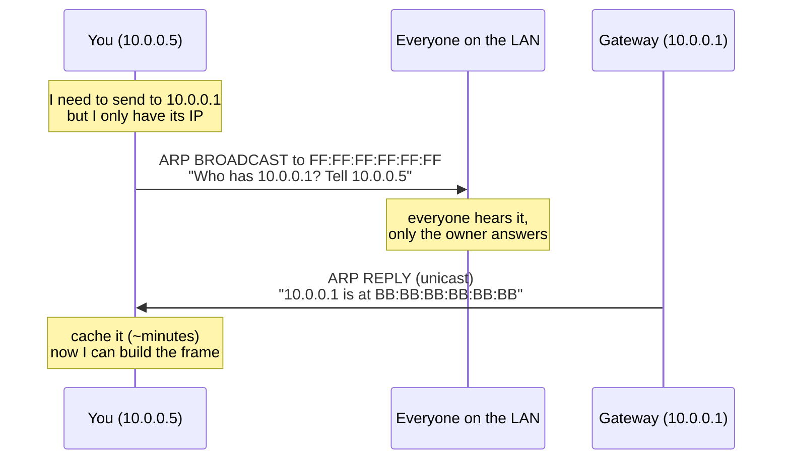
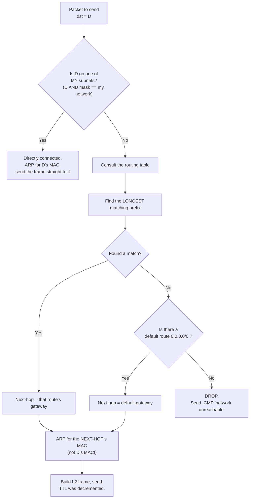
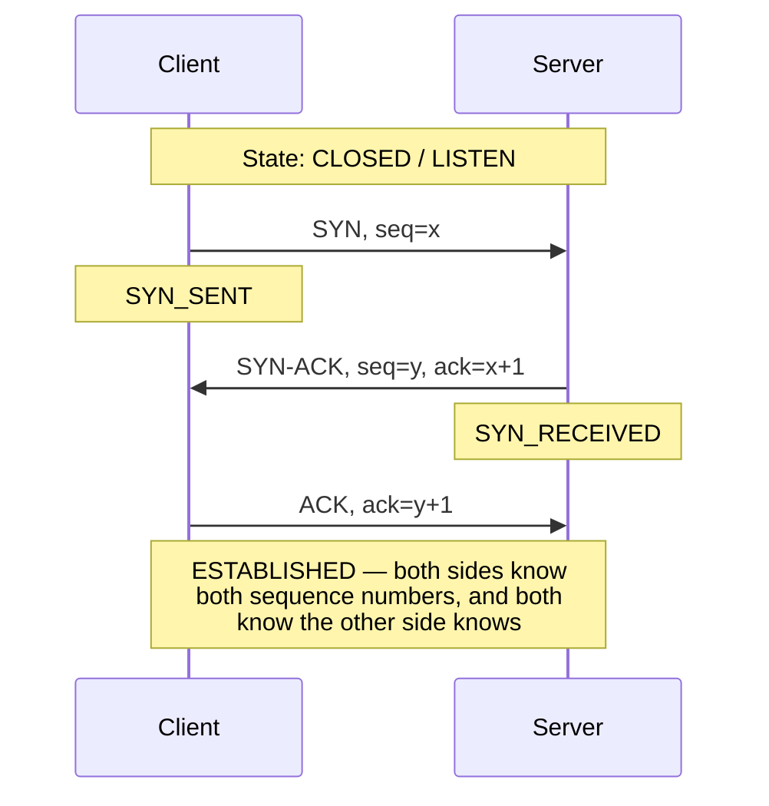
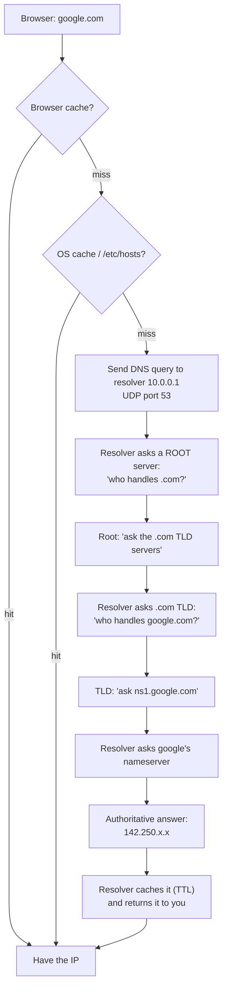
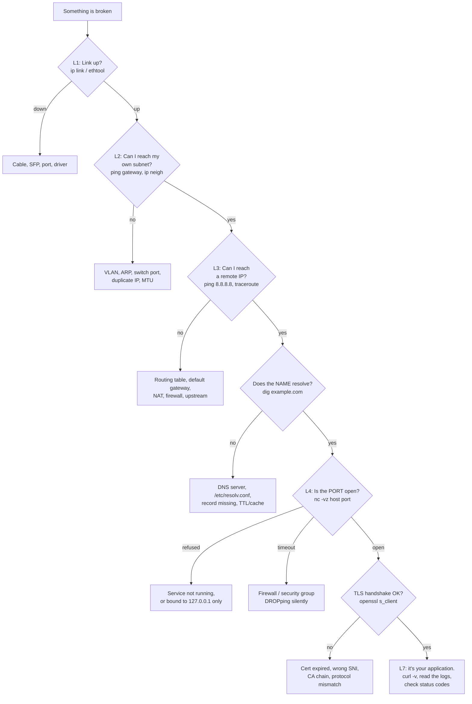

# The OSI Model — From First Principles

> Goal of this note: not to memorise "Please Do Not Throw Sausage Pizza Away", but to
> **re-derive** the seven layers so that if you woke up tomorrow having forgotten them,
> you could invent them again from scratch.

---

## Table of Contents

1. [Part 0 — The Only Problem in Networking](#part-0--the-only-problem-in-networking)
2. [Part 1 — Deriving the Layers From Nothing](#part-1--deriving-the-layers-from-nothing)
3. [Part 2 — The Model, Assembled](#part-2--the-model-assembled)
4. [Part 3 — Encapsulation: How Data Actually Moves](#part-3--encapsulation-how-data-actually-moves)
5. [Part 4 — Layer 1: Physical](#part-4--layer-1-physical)
6. [Part 5 — Layer 2: Data Link](#part-5--layer-2-data-link)
7. [Part 6 — Layer 3: Network](#part-6--layer-3-network)
8. [Part 7 — Layer 4: Transport](#part-7--layer-4-transport)
9. [Part 8 — Layers 5 & 6: Session and Presentation](#part-8--layers-5--6-session-and-presentation)
10. [Part 9 — Layer 7: Application](#part-9--layer-7-application)
11. [Part 10 — The Full Journey: typing google.com](#part-10--the-full-journey-typing-googlecom)
12. [Part 11 — OSI vs TCP/IP: where the model lies](#part-11--osi-vs-tcpip-where-the-model-lies)
13. [Part 12 — Debugging by Layer](#part-12--debugging-by-layer)
14. [Part 13 — Cheat Sheet](#part-13--cheat-sheet)

---

## Part 0 — The Only Problem in Networking

Strip everything away. Here is the entire problem:

```
   Machine A                                          Machine B
┌─────────────┐                                    ┌─────────────┐
│             │                                    │             │
│  a program  │   wants to convey MEANING to  -->  │  a program  │
│             │                                    │             │
└─────────────┘                                    └─────────────┘
       ▲                                                  ▲
       │                                                  │
       └──────────────  but all that exists  ─────────────┘
                        between them is:

              ~~~~~~~~~~~~~~~~~~~~~~~~~~~~~~~~~~~~~~
               a piece of copper / glass / open air
               on which you can wiggle a voltage,
               a photon, or a radio wave.
              ~~~~~~~~~~~~~~~~~~~~~~~~~~~~~~~~~~~~~
```

That's it. **One side has meaning. The middle has only physics.** Everything in
networking — every protocol, every RFC, every layer — exists to bridge that gap.

### Why layers at all?

You *could* write one gigantic program: "take this JSON, turn it into voltages, put it
on the wire." People tried. It fails for three reasons:

```
┌────────────────────────────────────────────────────────────────────┐
│  WITHOUT LAYERS                    │  WITH LAYERS                  │
├────────────────────────────────────┼───────────────────────────────┤
│  Swap copper → fibre?              │  Replace Layer 1 only.        │
│  Rewrite the whole stack.          │  Nothing above notices.       │
├────────────────────────────────────┼───────────────────────────────┤
│  N applications × M physical media │  N + M implementations.       │
│  = N×M implementations.            │                               │
├────────────────────────────────────┼───────────────────────────────┤
│  A bug could be anywhere.          │  Bisect: which layer's        │
│                                    │  promise was broken?          │
└────────────────────────────────────┴───────────────────────────────┘
```

**The core idea — memorise this one sentence:**

> Each layer makes a **promise** to the layer above it, and is allowed to make an
> **assumption** about the layer below it.

A layer is just a *contract*. The whole OSI model is seven contracts stacked up, where
each contract turns a messy reality into a clean abstraction.

```
        Layer N+1  ────────► "I need X"
                              ▲
                              │  PROMISE (the abstraction it sells)
                   ┌──────────┴──────────┐
                   │      Layer N        │   ← does the ugly work
                   └──────────┬──────────┘
                              │  ASSUMPTION (what it relies on)
                              ▼
        Layer N-1  ────────► "here's Y, imperfect but usable"
```

---

## Part 1 — Deriving the Layers From Nothing

Let's actually invent networking. Start with two machines and a wire.

### Step 1 — "I can wiggle a voltage." → **Layer 1: PHYSICAL**

You put +5V on the wire. The other side reads +5V. Congratulations, you sent... something.

Immediate problems:
- Is +5V a `1`? Is it a `0`? How long is one bit?
- If I hold +5V for a long time, is that one `1` or fifty `1`s?
- What connector? What voltage tolerance? What frequency?

None of these have a "correct" answer — they just need **agreement**. That agreement is
Layer 1.

```
  BEFORE L1:  "there is a wire"
  AFTER  L1:  "I can send a stream of bits to whatever is on the other end"
```

> **L1's promise:** a raw bit stream.
> **L1's known weakness:** it's a *dumb hose*. No structure, no error detection, no idea
> who it's for.

---

### Step 2 — "Bits are a soup." → **Layer 2: DATA LINK**

You now receive `...1011010011100010111001010111...`. Three problems:

**(a) Framing.** Where does one message start and end?
**(b) Errors.** Cosmic ray flipped a bit. Voltage noise. How do I know?
**(c) Sharing.** The wire isn't just you and one friend — it's a switch with 24 machines
on it. Which bits are *for me*? And if two of us transmit at once, we garble each other.

So you invent a **frame**: put delimiters around the bits, add an address so each machine
knows what's theirs, add a checksum so corruption is detectable, and add rules about who
transmits when.

```
    raw bits from L1:   ...101101001110001011100101011100010101...
                                  │
                                  ▼  L2 imposes structure
    ┌──────┬──────────┬──────────┬──────────────────────┬──────┐
    │ SYNC │ TO: whom │ FROM: me │       payload        │ CRC  │
    └──────┴──────────┴──────────┴──────────────────────┴──────┘
            └── addressing ──┘                            └ error check
```

```
  BEFORE L2:  "a stream of bits to whoever is on the wire"
  AFTER  L2:  "a discrete, error-CHECKED message to a specific machine
               on my local wire"
```

> **L2's promise:** delivery of a *frame* to a directly-reachable neighbour.
> **L2's known weakness:** *"directly-reachable"*. It only works inside one local network.
> It has no concept of "somewhere far away".

---

### Step 3 — "The world cannot be one wire." → **Layer 3: NETWORK**

Why can't we just put all 5 billion internet devices on one giant Layer-2 network?

```
┌──────────────────────────────────────────────────────────────────┐
│  Three hard walls:                                               │
│                                                                  │
│  1. PHYSICS   — a signal degrades; you can't run copper from      │
│                 Bengaluru to Boston.                             │
│                                                                  │
│  2. CONTENTION— if everyone shares one medium, everyone waits.   │
│                 Throughput → 0 as machines → ∞.                  │
│                                                                  │
│  3. STATE     — every switch would need a table of 5 billion     │
│                 addresses. L2 addresses are FLAT (no structure), │
│                 so they cannot be summarised.                    │
└──────────────────────────────────────────────────────────────────┘
```

So: build **many small L2 networks**, and put a box between them that can pick up a
message from one and drop it into another. That box is a **router**.

But now you need two new things:

**(a) A global, *hierarchical* address.** Hierarchical so routers can summarise:
"everything starting with `103.21.*` — send it that way", instead of memorising every
individual host.

**(b) Routing — path selection.** Out of many possible next hops, which one?

```
                        ┌─────────┐
           ┌────────────┤ Router  ├────────────┐
           │            │    R2   │            │
           │            └─────────┘            │
     ┌─────┴────┐                        ┌─────┴────┐
     │ Router   │                        │ Router   │
     │    R1    │────────────────────────│    R3    │
     └─────┬────┘        (direct)        └─────┬────┘
           │                                   │
    ┌──────┴──────┐                     ┌──────┴──────┐
    │  LAN "A"    │                     │  LAN "B"    │
    │  (Layer 2)  │                     │  (Layer 2)  │
    │  You ●      │                     │      ● Them │
    └─────────────┘                     └─────────────┘

  Each LAN is its own Layer-2 island.
  Layer 3 is the ferry service between islands.
```

Crucially: **each hop is a fresh Layer-2 delivery.** The L3 address (where it's ultimately
going) stays the same the whole way; the L2 address (who hands it to whom *right now*)
is rewritten at every single hop. This is the single most important mechanical fact in
networking, and we'll draw it again later.

```
  BEFORE L3:  "I can reach machines on my own wire"
  AFTER  L3:  "I can reach ANY machine in the world, by global address"
```

> **L3's promise:** best-effort global delivery.
> **L3's known weakness:** ***best-effort***. Packets may be dropped (a router's queue was
> full), duplicated, or arrive out of order (they took different paths). L3 does not care
> and does not tell you.

---

### Step 4 — "Best-effort isn't good enough, and 'a machine' isn't a destination."
### → **Layer 4: TRANSPORT**

Two independent problems here, both solved at L4.

**(a) Which *program*?** The packet arrived at IP `10.0.0.5`. But that machine is running
a browser, Slack, a Postgres server, an SSH daemon. "The machine" is not a useful
destination — a *process* is. So we invent the **port number**.

```
                  ┌──────────────────────────────────────┐
     packet ────► │        Host 10.0.0.5                 │
    for :443      │                                      │
                  │   :22   :443   :5432   :8080         │
                  │    │      │      │       │           │
                  │   sshd  nginx  postgres  app         │
                  └──────────────────────────────────────┘

     IP address = "which building"     Port = "which apartment"
```

**(b) Reliability.** L3 loses things. If you want a guarantee, *someone* must:
- number the pieces (so reordering is fixable),
- acknowledge what arrived (so loss is detectable),
- retransmit what didn't (so loss is fixable),
- slow down when the network is drowning (congestion control),
- slow down when the *receiver* is drowning (flow control).

Notice: this must happen **end-to-end**, at the two endpoints — not hop by hop. A router
in the middle has no idea what the complete conversation looks like. (This is the famous
*end-to-end principle*.)

```
  BEFORE L4:  "packets might reach the right machine, or might not"
  AFTER  L4:  "an ordered, reliable, flow-controlled byte stream between
               a program on A and a program on B"     (if you chose TCP)
              — or —
              "cheap, unreliable datagrams to a program"  (if you chose UDP)
```

> **L4's promise:** process-to-process delivery, with an *optional* reliability guarantee.
> **L4's known weakness:** it delivers *bytes*. It has no idea what they mean.

---

### Step 5 — "Bytes still aren't meaning." → **Layers 5, 6, 7**

You now have a perfect pipe of bytes between two programs. Three things are still missing,
and OSI gives each its own layer:

```
┌───────────────────────────────────────────────────────────────────────┐
│  L5 SESSION       Who starts? Who is authenticated? If the pipe       │
│                   breaks at byte 4,000,000 of a 10 GB transfer, can   │
│                   we resume instead of restarting?                    │
│                   → dialogue management, checkpoints, resumption      │
├───────────────────────────────────────────────────────────────────────┤
│  L6 PRESENTATION  These bytes — are they UTF-8 or UTF-16? Big-endian  │
│                   or little? Compressed? Encrypted? Both sides must   │
│                   agree on REPRESENTATION before meaning survives.    │
│                   → encoding, serialisation, compression, encryption  │
├───────────────────────────────────────────────────────────────────────┤
│  L7 APPLICATION   The actual conversation. "GET /index.html".         │
│                   "SELECT * FROM users". "MAIL FROM: harish@..."      │
│                   → the semantics the user/program actually wanted    │
└───────────────────────────────────────────────────────────────────────┘
```

And that's the whole derivation. Seven layers, each one the answer to a specific,
unavoidable failure of the layer beneath it.

### The derivation in one diagram

```
  "I can wiggle a voltage"
            │
            │  but bits have no structure, no owner, no error check
            ▼
  L1 PHYSICAL ──────► gives: a bit stream
            │
            │  but which bits are mine? are they intact?
            ▼
  L2 DATA LINK ─────► gives: framed, checked delivery to a NEIGHBOUR
            │
            │  but the world is bigger than one wire
            ▼
  L3 NETWORK ───────► gives: global, best-effort delivery to a HOST
            │
            │  but packets get lost, and a host runs many programs
            ▼
  L4 TRANSPORT ─────► gives: reliable(ish) delivery to a PROCESS
            │
            │  but a byte stream isn't a conversation
            ▼
  L5 SESSION ───────► gives: a managed, resumable dialogue
            │
            │  but bytes have no agreed representation
            ▼
  L6 PRESENTATION ──► gives: common encoding / encryption / compression
            │
            │  but we still haven't said anything
            ▼
  L7 APPLICATION ───► gives: MEANING.  "GET /index.html HTTP/1.1"
```

---

## Part 2 — The Model, Assembled

### The classic picture

```
        HOST A                                        HOST B
   ┌──────────────┐                              ┌──────────────┐
 7 │ APPLICATION  │◄──── HTTP, DNS, SMTP, SSH ──►│ APPLICATION  │
   ├──────────────┤                              ├──────────────┤
 6 │ PRESENTATION │◄──── TLS, UTF-8, JPEG, gzip ►│ PRESENTATION │
   ├──────────────┤                              ├──────────────┤
 5 │   SESSION    │◄──── sockets, RPC, SMB ─────►│   SESSION    │
   ├──────────────┤                              ├──────────────┤
 4 │  TRANSPORT   │◄──── TCP, UDP, QUIC, SCTP ──►│  TRANSPORT   │
   ├──────────────┤                              ├──────────────┤
 3 │   NETWORK    │◄──── IP, ICMP, BGP, OSPF ───►│   NETWORK    │
   ├──────────────┤                              ├──────────────┤
 2 │  DATA LINK   │◄──── Ethernet, Wi-Fi, ARP ──►│  DATA LINK   │
   ├──────────────┤                              ├──────────────┤
 1 │   PHYSICAL   │◄──── copper, fibre, radio ──►│   PHYSICAL   │
   └──────┬───────┘                              └──────▲───────┘
          │                                             │
          └─────────── the only real path ──────────────┘
                       (everything else is
                        a useful fiction)
```

The horizontal arrows are **peer protocols** — a *logical* conversation. HOST A's TCP
genuinely believes it is talking to HOST B's TCP. It is a fiction maintained by the layers
below. Data really only travels **down** A's stack, **across** the wire, and **up** B's
stack.

### Two views worth holding simultaneously

```
  VIEW 1 — The Fiction (how you should THINK about it)

     A:L4  ══════════ "a reliable byte pipe" ══════════  B:L4


  VIEW 2 — The Reality (what actually HAPPENS)

     A:L4 ─┐                                            ┌─► B:L4
           │                                            │
     A:L3 ─┤                                            ├── B:L3
           │                                            │
     A:L2 ─┤                                            ├── B:L2
           │                                            │
     A:L1 ─┴──────────── electrons / photons ───────────┴── B:L1
```

### The layer-numbering mnemonic (for when you're tired)

| # | Layer | Mnemonic word | One-word job |
|---|-------|---------------|--------------|
| 7 | Application  | **A**way      | Meaning |
| 6 | Presentation | **P**izza     | Format |
| 5 | Session      | **S**ausage   | Dialogue |
| 4 | Transport    | **T**hrow     | Reliability + ports |
| 3 | Network      | **N**ot       | Global addressing + routing |
| 2 | Data Link    | **D**o        | Local addressing + framing |
| 1 | Physical     | **P**lease    | Bits on a medium |

*(Bottom-up: **P**lease **D**o **N**ot **T**hrow **S**ausage **P**izza **A**way)*

---

## Part 3 — Encapsulation: How Data Actually Moves

This is the mechanical heart of the model. Each layer takes whatever the layer above
handed it, treats it as **opaque payload**, and wraps it in its own header.

> A layer never looks inside its payload. That's the whole discipline.

### The nesting

```
L7  APPLICATION          ┌───────────────────────────────┐
    your actual data     │            DATA               │
                         └───────────────────────────────┘

L6/L5 encode, encrypt    ┌───────────────────────────────┐
    (often inside L7)    │       DATA (TLS-wrapped)      │
                         └───────────────────────────────┘

L4  TRANSPORT      ┌─────┬───────────────────────────────┐
    + ports, seq#  │ TCP │            DATA               │   → SEGMENT
                   └─────┴───────────────────────────────┘

L3  NETWORK   ┌────┬─────┬───────────────────────────────┐
    + src/dst │ IP │ TCP │            DATA               │   → PACKET
      IP, TTL └────┴─────┴───────────────────────────────┘

L2  DATA LINK ┌─────┬────┬─────┬───────────────────────────────┬─────┐
    + MACs,   │ ETH │ IP │ TCP │            DATA               │ FCS │ → FRAME
      checksum└─────┴────┴─────┴───────────────────────────────┴─────┘

L1  PHYSICAL      1011010011100010111001010111000101011101...        → BITS
```

On the receiving side the exact reverse happens — **decapsulation**. Each layer strips
its own header, sanity-checks it, and passes the rest up.

### The PDU names (Protocol Data Unit)

Interviewers love these. They're just "what you call the thing at that layer".

| Layer | PDU name | Contains |
|-------|----------|----------|
| 5–7 | **Data** | whatever the app means |
| 4 | **Segment** (TCP) / **Datagram** (UDP) | + ports, sequence numbers |
| 3 | **Packet** | + source & destination IP |
| 2 | **Frame** | + source & destination MAC, checksum |
| 1 | **Bits / Symbols** | voltages, light pulses, radio |

### The single most important mechanical fact

Watch which addresses change as a packet crosses the internet:

```
  YOU              ROUTER R1            ROUTER R2            SERVER
  10.0.0.5         (your gateway)                            142.250.x.x
  MAC: AA          MAC: BB / CC         MAC: DD / EE         MAC: FF

  ┌────────── HOP 1 ──────────┐
  │ src MAC: AA   dst MAC: BB │   ← L2 addresses: LOCAL, rewritten each hop
  │ src IP : 10.0.0.5         │
  │ dst IP : 142.250.x.x      │   ← L3 addresses: END-TO-END, unchanged
  └───────────────────────────┘
                 ▼
  ┌────────── HOP 2 ──────────┐
  │ src MAC: CC   dst MAC: DD │   ← CHANGED
  │ src IP : 10.0.0.5         │
  │ dst IP : 142.250.x.x      │   ← SAME
  └───────────────────────────┘
                 ▼
  ┌────────── HOP 3 ──────────┐
  │ src MAC: EE   dst MAC: FF │   ← CHANGED
  │ src IP : 10.0.0.5         │
  │ dst IP : 142.250.x.x      │   ← SAME
  └───────────────────────────┘
```

**L3 address = the final destination. L2 address = the next pair of hands.**

The analogy: you post a parcel from Bengaluru to Boston. The *shipping label* (L3) says
"Boston" the entire journey. But the van driver, the airport loader, and the postman are
all different people (L2) — each one only knows "give it to the next guy".

*(Caveat: NAT — your home router — does rewrite the source IP. That's precisely why NAT
is considered a layering violation. More on this later.)*

### Why the header is *before* the payload

Not arbitrary. A router must decide where to forward a packet **while it's still arriving**
— it can't wait for the whole thing. Header-first enables *cut-through* forwarding and
streaming parsers. (Layer 2's checksum, by contrast, is a *trailer* — you can only compute
a checksum after seeing all the data.)

---

## Part 4 — Layer 1: PHYSICAL

> **Problem:** there is a piece of matter between us and nothing else.
> **Promise:** a stream of bits will come out the far end (probably).

### What it actually defines

```
┌─────────────────────────────────────────────────────────────────┐
│ MECHANICAL   connector shape, pin count, cable specs            │
│              RJ45, LC/SC fibre connectors, QSFP28 cages         │
├─────────────────────────────────────────────────────────────────┤
│ ELECTRICAL   voltage levels, impedance, current                 │
│              "+2.5V = 1, -2.5V = 0"                             │
├─────────────────────────────────────────────────────────────────┤
│ FUNCTIONAL   what each pin/wire DOES (TX+, TX-, RX+, RX-)       │
├─────────────────────────────────────────────────────────────────┤
│ PROCEDURAL   link-up negotiation, auto-negotiation of speed     │
│              and duplex, clock recovery                         │
└─────────────────────────────────────────────────────────────────┘
```

### Line coding — the non-obvious part

You cannot simply send "high = 1, low = 0". Send a hundred `0`s in a row and the receiver's
clock drifts — it loses count of how many bits went by.

```
  NAIVE (NRZ):   1   1   0   0   0   0   0   0   1
                ┌───┬───┐                       ┌───
                │       │                       │
             ───┘       └───────────────────────┘
                         ▲
                         └── how many zeros was that? Receiver has to
                             guess. Clocks drift. Data corrupts.

  MANCHESTER:  every bit has a TRANSITION in the middle
                 1 = low→high    0 = high→low
                ┌─┐ ┌─┐   ┌─┐ ┌─┐ ┌─┐
                │ │ │ │   │ │ │ │ │ │      transitions are constant →
              ──┘ └─┘ └───┘ └─┘ └─┘ └──    receiver re-syncs its clock
                                            on every single bit
```

Real Ethernet uses smarter schemes (4B/5B, 8b/10b, 64b/66b, PAM-4) that trade a little
bandwidth for guaranteed transitions. The principle is the same: **the data must carry
its own clock.**

### Key concepts

| Concept | Meaning |
|---------|---------|
| **Bandwidth** | bits per second the medium can carry |
| **Latency** | time for one bit to travel end-to-end (bounded by *c*) |
| **Attenuation** | signal weakens with distance → repeaters, max cable lengths |
| **Duplex** | half (one direction at a time) vs full (both simultaneously) |
| **Baseband vs broadband** | one signal on the wire vs many frequency channels |

### Devices that live here

**Hub**, **repeater**, **cable**, **transceiver / SFP**, **NIC (the PHY part)**.

A hub is the purest Layer-1 device: electrical signal in on one port, blindly copied to
every other port. It has no idea what a frame is.

### What breaks

Cable unplugged. Wrong SFP. Duplex mismatch. Bad crimp. Interference from a nearby motor.
Fibre bent past its radius. **Symptom:** no link light, or link light with massive
error counters.

```bash
ip -s link show eth0        # look for "errors", "dropped", "carrier"
ethtool eth0                # speed, duplex, "Link detected: yes/no"
```

---

## Part 5 — Layer 2: DATA LINK

> **Assumption:** L1 gives me a bit stream, possibly corrupted.
> **Promise:** a *framed*, *error-checked* message delivered to a specific machine
> **on my local network segment.**

### Its two sub-layers

```
┌───────────────────────────────────────────────────────────────┐
│  LLC — Logical Link Control                                   │
│  "which upper-layer protocol is this payload?"                │
│  (In Ethernet II this collapsed into the 2-byte EtherType.)   │
├───────────────────────────────────────────────────────────────┤
│  MAC — Media Access Control                                   │
│  "who is allowed to transmit right now, and who is this for?" │
│  Addressing + arbitration.                                    │
└───────────────────────────────────────────────────────────────┘
```

### The Ethernet frame

```
┌──────────┬─────┬──────────┬──────────┬───────┬─────────────┬─────┐
│ Preamble │ SFD │ Dest MAC │ Src  MAC │ Type  │   Payload   │ FCS │
│  7 bytes │ 1 B │ 6 bytes  │ 6 bytes  │  2 B  │ 46–1500 B   │ 4 B │
└──────────┴─────┴──────────┴──────────┴───────┴─────────────┴─────┘
      │       │        │           │       │          │         │
      │       │        │           │       │          │         └─ CRC-32.
      │       │        │           │       │          │            Corrupt? DROP.
      │       │        │           │       │          │            (No repair,
      │       │        │           │       │          │             no notify.)
      │       │        │           │       │          └─ the L3 packet
      │       │        │           │       └─ 0x0800 = IPv4
      │       │        │           │          0x0806 = ARP
      │       │        │           │          0x86DD = IPv6
      │       │        │           └─ who sent it (learned by switches)
      │       │        └─ who it's for
      │       └─ "start of frame" marker: 10101011
      └─ 1010101010... lets receiver lock its clock onto the signal
```

**MTU** = that `1500`. The biggest payload one frame can carry. Every "why is my VPN
slow / why does this one large request hang" mystery eventually traces back to MTU.

### MAC addresses — flat, global, burned-in

```
   AA:BB:CC : DD:EE:FF
   └───┬───┘   └──┬──┘
       │          └─ device serial (assigned by the manufacturer)
       └─ OUI — Organisationally Unique Identifier
          (identifies the manufacturer: Intel, Apple, Cisco...)

   Special: FF:FF:FF:FF:FF:FF = BROADCAST — "everyone on this segment"
```

They are **flat** — `AA:BB:CC:00:00:01` and `AA:BB:CC:00:00:02` tell you nothing about
location. That's exactly why they can't scale globally and why Layer 3 must exist.

### How a switch works — the one algorithm to know

A switch is a Layer-2 device that learns by watching.

```
  ┌──────────────────── MAC ADDRESS TABLE ────────────────────┐
  │   MAC              →  Port                                │
  │   AA:...:01        →  1                                   │
  │   AA:...:02        →  3                                   │
  └───────────────────────────────────────────────────────────┘

  ALGORITHM, on every frame received:

    1. LEARN    : record (source MAC → the port it arrived on)
    2. LOOK UP  : is the destination MAC in the table?
         ├─ YES → FORWARD out only that one port
         └─ NO  → FLOOD out every port except the one it came in on
                  (and learn the answer when a reply comes back)
```

That's it. A switch is a self-populating hash table. Contrast with a hub, which always
floods, forever.

### ARP — the glue between L3 and L2

You know the destination *IP*. To build an Ethernet frame you need its *MAC*. ARP is the
lookup.



ARP is a beautiful example of a layering seam: it's an L2 protocol whose entire job is to
resolve an L3 address. It doesn't sit cleanly at either layer.

```bash
ip neigh show          # your ARP cache (Linux)
arp -a                 # macOS / BSD
```

### Other L2 things worth knowing

| Thing | What it solves |
|-------|----------------|
| **VLAN (802.1Q)** | one physical switch → many isolated logical LANs. Adds a 4-byte tag to the frame. |
| **STP** | loops in a switched network cause broadcast storms that melt the network. STP prunes the topology into a loop-free tree. |
| **CSMA/CD** | the old shared-medium rule: listen; if quiet, send; if collision, back off randomly. Obsolete on switched full-duplex Ethernet. |
| **CSMA/CA** | Wi-Fi's version: you *can't* detect collisions on radio, so you avoid them instead (RTS/CTS, random backoff before sending). |
| **LACP** | bond several physical links into one logical link. |

### Devices that live here

**Switch**, **bridge**, **NIC**, **wireless access point**.

### What breaks

Wrong VLAN. ARP cache poisoned or stale. MTU mismatch. Spanning-tree loop. Duplicate MAC.
**Symptom:** you can ping some hosts on the LAN but not others; or everything on the local
subnet works and nothing beyond it does.

---

## Part 6 — Layer 3: NETWORK

> **Assumption:** L2 can deliver a frame to any *neighbour* on my local segment.
> **Promise:** best-effort delivery of a packet to **any host in the world**.

Two jobs: **global addressing** and **routing**.

### The IPv4 header

```
 0                   1                   2                   3
 0 1 2 3 4 5 6 7 8 9 0 1 2 3 4 5 6 7 8 9 0 1 2 3 4 5 6 7 8 9 0 1
┌───────┬───────┬───────────────┬───────────────────────────────┐
│Version│  IHL  │ Type of Svc   │         Total Length          │
├───────┴───────┴───────────────┼─────┬─────────────────────────┤
│        Identification         │Flags│      Fragment Offset    │
├───────────────┬───────────────┼─────┴─────────────────────────┤
│  Time To Live │   Protocol    │        Header Checksum        │
├───────────────┴───────────────┴───────────────────────────────┤
│                     Source IP Address                         │
├───────────────────────────────────────────────────────────────┤
│                   Destination IP Address                      │
└───────────────────────────────────────────────────────────────┘

  TTL       decremented by EVERY router. Hits 0 → packet dropped +
            ICMP "time exceeded" sent back. This is what makes
            traceroute possible, and what stops routing loops from
            circulating packets forever.

  Protocol  6 = TCP, 17 = UDP, 1 = ICMP. This is the "what's inside"
            pointer — the L3→L4 equivalent of EtherType.

  Flags/    used for fragmentation when a packet is too big for the
  Frag      next link's MTU. The "DF" (Don't Fragment) bit is what
            makes Path MTU Discovery work.
```

### IP addresses are hierarchical — and that is the whole point

```
      192.168.10.37 / 24
      └──────┬──────┘ └┬┘
             │         └─ prefix length: the first 24 bits
             │            are the NETWORK, the rest is the HOST
             │
             └─ 11000000.10101000.00001010.00100101
                └──────── network ────────┘└─ host ┘

   Therefore:
     network address    192.168.10.0     (all host bits 0)
     broadcast address  192.168.10.255   (all host bits 1)
     usable hosts       192.168.10.1 – .254   (254 of them)
```

Because addresses are hierarchical, a router doesn't need 5 billion entries. It needs
*prefixes*: "anything matching `103.21.244.0/22`, send out interface eth1." Millions of
hosts collapse into one table row. **Hierarchy is what makes global routing tractable.**

### The forwarding decision — the core router algorithm



**Longest prefix match** — if the table has both `10.0.0.0/8` and `10.1.2.0/24`, a packet
to `10.1.2.5` uses the `/24`. More specific always wins.

```bash
ip route          # your routing table
ip route get 8.8.8.8    # "which route would actually be used?"
```

### Routing vs forwarding — a distinction people blur

```
┌──────────────────────────────┬──────────────────────────────────┐
│  ROUTING (control plane)     │  FORWARDING (data plane)         │
├──────────────────────────────┼──────────────────────────────────┤
│  Building the map.           │  Using the map.                  │
│  Slow, runs in software,     │  Fast, runs in hardware (ASIC),  │
│  happens occasionally.       │  happens per-packet.             │
│  Protocols: OSPF, BGP, RIP   │  One table lookup, decrement     │
│                              │  TTL, rewrite L2 header, out.    │
└──────────────────────────────┴──────────────────────────────────┘
```

### The protocol family at L3

| Protocol | Job |
|----------|-----|
| **IPv4 / IPv6** | the addressing + packet format itself |
| **ICMP** | the *diagnostics* channel. `ping`, "host unreachable", "TTL exceeded", "fragmentation needed". Not for carrying data. |
| **OSPF / IS-IS** | interior routing: find best paths *inside* one organisation |
| **BGP** | exterior routing: how ~75,000 autonomous systems agree on paths. The protocol that holds the internet together. |
| **NAT** | rewrite addresses so many private hosts share one public IP |
| **IPsec** | encrypt/authenticate at L3 (this is what your site-to-site VPN is) |

### Why `traceroute` works — a lovely TTL trick

```
  Send packet with TTL = 1  ──► R1 decrements to 0, DROPS it,
                                sends back ICMP "time exceeded".
                                Now you know R1's address.

  Send packet with TTL = 2  ──► R1 → R2 decrements to 0, drops,
                                replies. Now you know R2.

  Send packet with TTL = 3  ──► ... and so on, until the real
                                destination replies.
```

You are deliberately building packets that are designed to die, one hop further each time,
and collecting the death notices.

### Devices that live here

**Router**, **Layer-3 switch**, **firewall** (the IP-filtering part).

### What breaks

Wrong default gateway. Missing route. Asymmetric routing. Subnet mask typo. NAT
misconfiguration. MTU black hole (ICMP "frag needed" being firewalled — a classic).
**Symptom:** ARP works, local ping works, anything off-subnet fails.

---

## Part 7 — Layer 4: TRANSPORT

> **Assumption:** L3 might deliver my packet to the right host. Might not. Might deliver
> it twice, or out of order.
> **Promise:** delivery to the right **process**, optionally with a guarantee.

This is the layer where *you*, as an application developer, actually live. Everything
below is the network's problem; everything here and above is yours.

### The fundamental choice: TCP or UDP

```
┌────────────────────────────┬────────────────────────────────────┐
│           TCP              │              UDP                   │
├────────────────────────────┼────────────────────────────────────┤
│  connection-oriented       │  connectionless                    │
│  reliable (retransmits)    │  unreliable (fire and forget)      │
│  ordered                   │  unordered                         │
│  flow + congestion control │  none — you can flood the network  │
│  stream of BYTES           │  discrete MESSAGES                 │
│  20-byte header            │  8-byte header                     │
│  handshake before data     │  just send                         │
│                            │                                    │
│  "I need it CORRECT"       │  "I need it NOW"                   │
│                            │                                    │
│  HTTP/1&2, SSH, SMTP,      │  DNS, DHCP, VoIP, games, video,    │
│  databases, file transfer  │  QUIC/HTTP3, NTP, syslog           │
└────────────────────────────┴────────────────────────────────────┘
```

The deep insight: **TCP's reliability is a cost, not a free gift.** For a video call, a
retransmitted packet from 300 ms ago is *worthless* — you'd rather have a glitch than a
stall. That's why real-time media uses UDP and rebuilds only the reliability it actually
wants, at the application layer.

### The TCP header

```
 0                   1                   2                   3
 0 1 2 3 4 5 6 7 8 9 0 1 2 3 4 5 6 7 8 9 0 1 2 3 4 5 6 7 8 9 0 1
┌───────────────────────────────┬───────────────────────────────┐
│          Source Port          │      Destination Port         │
├───────────────────────────────┴───────────────────────────────┤
│                       Sequence Number                         │
├───────────────────────────────────────────────────────────────┤
│                   Acknowledgment Number                       │
├───────┬───────────┬───────────┬───────────────────────────────┤
│ Offset│Reserved(6)│U A P R S F│          Window Size          │
├───────┴───────────┴───────────┼───────────────────────────────┤
│           Checksum            │        Urgent Pointer         │
└───────────────────────────────┴───────────────────────────────┘

   Seq #      byte-offset of this segment in the overall stream
   Ack #      "I have received everything up to (but not including) this"
   Flags      SYN (start), ACK (acknowledge), FIN (finish),
              RST (abort), PSH (deliver now), URG (urgent)
   Window     "I have this many bytes of buffer left" — FLOW CONTROL
```

### The three-way handshake — why *three*?

Each side needs to (a) announce its starting sequence number and (b) know the other side
received it. That's two facts × two directions = four, but two of them ride along together.



A two-way handshake would leave the *server* unsure whether the client ever heard its
sequence number. A four-way is redundant. Three is the minimum.

Closing takes **four** messages, because TCP is full-duplex — each direction must be shut
down independently (`FIN` / `ACK`, then `FIN` / `ACK` the other way).

### Reliability, drawn

```
  SENDER                                      RECEIVER

  send seq=1000 ───────────────────────────►  got it
  send seq=2000 ───────────────────────X      LOST
  send seq=3000 ───────────────────────────►  got it (out of order!)
                                              buffer it, and say
              ◄──────────────────── ACK 2000  "I still only have
                                               up to 2000"
              ◄──────────────────── ACK 2000  (duplicate ACK)
              ◄──────────────────── ACK 2000  (3rd dup ACK →
                                               FAST RETRANSMIT)
  resend seq=2000 ─────────────────────────►  now I have 1000,
                                              2000, 3000 in order
              ◄──────────────────── ACK 4000  deliver to the app
```

Three mechanisms in that picture:
1. **Cumulative ACK** — "everything up to N".
2. **Duplicate ACKs** as a loss signal (faster than waiting for a timeout).
3. **Receiver-side buffering** so out-of-order arrivals aren't wasted.

### Flow control vs congestion control — often confused

```
┌─────────────────────────────────┬──────────────────────────────────┐
│  FLOW CONTROL                   │  CONGESTION CONTROL              │
├─────────────────────────────────┼──────────────────────────────────┤
│  Protects the RECEIVER.         │  Protects the NETWORK.           │
│                                 │                                  │
│  "Your buffer is full,          │  "Routers in the middle are      │
│   slow down."                   │   dropping packets, back off."   │
│                                 │                                  │
│  Explicit: the Window field     │  Inferred: from packet loss or   │
│  in every ACK.                  │  rising RTT. Nobody tells you.   │
│                                 │                                  │
│  Simple.                        │  Slow start, congestion          │
│                                 │  avoidance, CUBIC, BBR...        │
└─────────────────────────────────┴──────────────────────────────────┘

  Effective send rate = min(receiver window, congestion window)
```

Congestion control is genuinely remarkable: millions of independent TCP senders, with no
central coordinator and no feedback from the network, collectively converge on *not*
melting the internet. They infer congestion purely from their own packet loss.

### Ports

```
  0    – 1023    Well-known   (22 SSH, 53 DNS, 80 HTTP, 443 HTTPS,
                               5432 Postgres, 6379 Redis)
  1024 – 49151   Registered   (8080, 3000, 9092 Kafka, ...)
  49152– 65535   Ephemeral    (what YOUR client gets, at random,
                               for each outgoing connection)
```

A connection is identified by a **4-tuple** — this is why one server on port 443 can hold
a million simultaneous connections:

```
   ( source IP , source port , dest IP , dest port )
     10.0.0.5     51234        142.250.x.x   443     ← connection A
     10.0.0.5     51235        142.250.x.x   443     ← connection B  (different!)
     10.0.0.9     51234        142.250.x.x   443     ← connection C  (different!)
```

```bash
ss -tulpn          # what's listening, and on what (Linux)
lsof -i -P -n      # same idea, macOS-friendly
ss -tan state established
```

### What breaks

Port not listening. Firewall dropping SYN (connection *hangs*) vs rejecting it
(connection *refused* — instant). Connection pool exhausted. `TIME_WAIT` buildup.
Retransmissions from a lossy link.
**Symptom:** `ping` works fine, `curl` hangs or is refused. That's the classic
"L3 is fine, L4 is not" signature.

---

## Part 8 — Layers 5 & 6: SESSION and PRESENTATION

Honest framing up front: **these are the two layers that did not survive contact with
reality.** In the real internet, their responsibilities got absorbed into applications
and libraries. But the *concepts* are real and worth having names for.

### Layer 5 — Session

> **Promise:** a managed *dialogue*, not just a pipe.

```
┌──────────────────────────────────────────────────────────────┐
│  ESTABLISH    authenticate, negotiate parameters, open       │
├──────────────────────────────────────────────────────────────┤
│  MAINTAIN     who speaks now? (half-duplex turn-taking)      │
│               keepalives / heartbeats                        │
├──────────────────────────────────────────────────────────────┤
│  CHECKPOINT   mark byte 4,000,000 as "confirmed"             │
├──────────────────────────────────────────────────────────────┤
│  RECOVER      pipe broke → resume from the checkpoint,       │
│               don't restart the 10 GB transfer               │
├──────────────────────────────────────────────────────────────┤
│  TERMINATE    orderly close                                  │
└──────────────────────────────────────────────────────────────┘
```

Where you actually meet it today:

- An **HTTP session cookie** — the server keeping state across many independent TCP
  connections. Pure L5 thinking, implemented at L7.
- **TLS session resumption** — reusing a negotiated secret to skip a handshake.
- **QUIC connection IDs** — your connection survives changing Wi-Fi → cellular, because
  the session identity is no longer the 4-tuple.
- An HTTP `Range:` request resuming an interrupted download.
- **RPC frameworks**, **SMB**, **NetBIOS**, **PPTP**.

### Layer 6 — Presentation

> **Promise:** both sides interpret the same bytes the same way.

Three jobs:

```
┌───────────────────────────────────────────────────────────────┐
│ 1. TRANSLATION / ENCODING                                     │
│    character sets: UTF-8, UTF-16, ASCII, EBCDIC               │
│    byte order:     big-endian vs little-endian                │
│    serialisation:  JSON, Protobuf, ASN.1, XML, MessagePack    │
│    media formats:  JPEG, PNG, MPEG, GIF                       │
├───────────────────────────────────────────────────────────────┤
│ 2. COMPRESSION                                                │
│    gzip, brotli, zstd — fewer bytes on the wire               │
├───────────────────────────────────────────────────────────────┤
│ 3. ENCRYPTION                                                 │
│    TLS/SSL — the bytes are unreadable to anyone in the middle │
└───────────────────────────────────────────────────────────────┘
```

Why this matters concretely:

```
   Machine A (little-endian x86)        Machine B (big-endian, e.g. old SPARC)

   int 1 in memory:  01 00 00 00   ───►   reads it as 16,777,216
                                           ┗━ silently, catastrophically wrong

   Fix: agree on a WIRE FORMAT (network byte order = big-endian).
        htonl() / ntohl() exist precisely for this.
        That function call IS Layer 6.
```

### Where does TLS live? — the honest answer

This is a favourite interview trap.

```
  Textbook answer:        Layer 6 (it's encryption = presentation)
  Purist answer:          Layer 5 (it has a handshake, session IDs, resumption)
  Pragmatic answer:       it sits on top of TCP and under HTTP, so ~5/6
  Correct answer:         "It spans 5 and 6. The OSI model doesn't map cleanly
                           onto TLS, which is a sign the model is a teaching
                           tool, not an implementation spec."

     ┌──────────────┐
     │ HTTP    (L7) │
     ├──────────────┤
     │ TLS   (L5/6) │  ← handshake+session (5) AND encryption (6)
     ├──────────────┤
     │ TCP     (L4) │
     └──────────────┘
```

Give the last answer. It shows you understand the model *and* its limits.

---

## Part 9 — Layer 7: APPLICATION

> **Assumption:** everything below works.
> **Promise:** none — this is where meaning finally lives.

Common confusion: **Layer 7 is not your application.** Chrome is not Layer 7. Layer 7 is
the *protocol your application speaks* — the agreed grammar of the conversation.

```
   ┌────────────────────────────────────┐
   │   YOUR PROGRAM  (Chrome, curl)     │  ← not a layer. It's a user of L7.
   └────────────────┬───────────────────┘
                    │ uses
   ┌────────────────▼───────────────────┐
   │   L7 PROTOCOL   (HTTP)             │  ← the grammar: methods, headers,
   └────────────────────────────────────┘     status codes, semantics
```

### The major L7 protocols

| Protocol | Port | What it's for |
|----------|------|---------------|
| **HTTP/HTTPS** | 80 / 443 | the web, and by now ~every API |
| **DNS** | 53 | name → IP resolution |
| **SSH** | 22 | encrypted remote shell |
| **SMTP / IMAP / POP3** | 25 / 143 / 110 | mail send / mail fetch |
| **FTP / SFTP** | 21 / 22 | file transfer |
| **DHCP** | 67, 68 | "give me an IP address" on boot |
| **NTP** | 123 | clock sync |
| **gRPC**, **MQTT**, **AMQP** | various | RPC, IoT, message queues |

### What an L7 message looks like — it's just text (for HTTP/1.1)

```
  REQUEST                              RESPONSE
  ┌───────────────────────────────┐   ┌────────────────────────────────┐
  │ GET /search?q=osi HTTP/1.1    │   │ HTTP/1.1 200 OK                │
  │ Host: www.google.com          │   │ Content-Type: text/html        │
  │ User-Agent: curl/8.4.0        │   │ Content-Length: 5821           │
  │ Accept: */*                   │   │ Cache-Control: private         │
  │                               │   │                                │
  │ (blank line = end of headers) │   │ <!doctype html>...             │
  └───────────────────────────────┘   └────────────────────────────────┘
        └─ method, path, version            └─ version, status, reason
```

Everything below this is invisible to the programmer. That invisibility is the entire
payoff of seven layers of engineering.

### "Layer 7 load balancer" — what people mean

```
  L4 LOAD BALANCER                    L7 LOAD BALANCER
  ┌──────────────────────┐            ┌──────────────────────────────┐
  │ Sees: IP + port       │            │ Sees: the actual HTTP request│
  │ Decides: pick a       │            │ Decides: route by URL path,  │
  │   backend, forward    │            │   header, cookie, method     │
  │   the TCP stream      │            │                              │
  │                      │            │ /api/*   → service-a          │
  │ Fast, dumb, cheap.    │            │ /images/*→ service-b          │
  │ Cannot read HTTPS     │            │ Must terminate TLS to read    │
  │ (doesn't need to).    │            │ the request.                  │
  └──────────────────────┘            └──────────────────────────────┘
    e.g. AWS NLB, IPVS                   e.g. AWS ALB, nginx, Envoy
```

Now "L4 vs L7 load balancer" is obvious rather than jargon: it's literally *how far up the
stack does this box decapsulate before deciding*.

---

## Part 10 — The Full Journey: typing google.com

This is the integration exercise. If you can narrate this end to end, you understand the
model. Every layer appears, in order, doing exactly its one job.

### Stage 0 — Before anything: you need an identity (DHCP)

```
  You boot. You have a MAC address and nothing else.

  ┌─► DISCOVER  broadcast to FF:FF:FF:FF:FF:FF  "is there a DHCP server?"
  │             (src IP 0.0.0.0 — you don't have one yet)
  │
  ├─► OFFER     server: "take 10.0.0.5, mask /24, gateway 10.0.0.1,
  │             DNS 10.0.0.1, lease 24h"
  │
  ├─► REQUEST   you: "I'll take it"
  │
  └─► ACK       server: "it's yours"

  Now you have: an IP (L3), a gateway (L3), a DNS server (L7 service).
```

### Stage 1 — Name → address (DNS)

You typed `google.com`. Nothing in the network knows what that means.



Note the recursion: DNS is a distributed, hierarchical database, and the hierarchy is read
**right to left** (`google.com.` → root, then `.com`, then `google`).

Note also: that DNS query *itself* went down all seven layers and back up. Layer 7 (DNS)
→ Layer 4 (UDP:53) → Layer 3 (IP to 10.0.0.1) → Layer 2 (ARP for the gateway, then an
Ethernet frame) → Layer 1. Everything is turtles all the way down.

### Stage 2 — Is the destination local or remote?

```
   My IP    : 10.0.0.5/24     → my network is 10.0.0.0/24
   Target   : 142.250.190.78

   142.250.190.78 AND 255.255.255.0  =  142.250.190.0
   10.0.0.0                          ≠  142.250.190.0

   ⇒ REMOTE. I must send this to my DEFAULT GATEWAY (10.0.0.1),
     not to the destination directly.
```

### Stage 3 — Find the gateway's MAC (ARP)

```
   I know the gateway is 10.0.0.1 (L3).
   I need its MAC (L2) to build a frame.

   ARP cache empty? → broadcast "who has 10.0.0.1?"
   Reply: "BB:BB:BB:BB:BB:BB"

   ⚠ Key point: the frame's destination MAC is the GATEWAY's,
     but the packet's destination IP is GOOGLE's.
     This mismatch is not a bug — it IS routing.
```

### Stage 4 — TCP handshake, then TLS handshake

```
  Layer 4                             Layer 5/6
  ─────────────────────────────       ──────────────────────────────
  SYN          ───────────►
               ◄─────────── SYN-ACK
  ACK          ───────────►
  ── connection established ──
                                      ClientHello  ───────────►
                                      (ciphers, SNI: google.com)
                                                   ◄─────────── ServerHello
                                                                + certificate
                                      verify cert chain
                                      key exchange ───────────►
                                      ── encrypted channel up ──
```

### Stage 5 — Finally, the actual request

```
   L7:  GET / HTTP/1.1
        Host: www.google.com
             │
             ▼ encrypt (L6) — now unreadable to anyone in between
   L4:  [TCP hdr: src 51234 → dst 443, seq=...] [ciphertext]
             │
             ▼
   L3:  [IP hdr: 10.0.0.5 → 142.250.190.78, TTL 64] [TCP...]
             │
             ▼
   L2:  [ETH hdr: AA:.. → BB:.. (gateway), type 0x0800] [IP...] [FCS]
             │
             ▼
   L1:  101101001110001011100101011100010101110010...
```

### Stage 6 — The trip across, drawn in full

```
  ┌────────────┐
  │    YOU     │  L7 GET / ... ─┐
  │  10.0.0.5  │                │ encapsulate down
  │  MAC: AA   │  L1 bits ◄─────┘
  └─────┬──────┘
        │  frame: AA → BB
        ▼
  ┌────────────┐
  │  ROUTER 1  │  decapsulate to L3 only ──► read dst IP
  │ (gateway)  │                             look up route
  │ MAC: BB/CC │                             TTL 64 → 63
  │            │  re-encapsulate at L2 with NEW MACs
  └─────┬──────┘  (also: NAT rewrites your src IP to the public one)
        │  frame: CC → DD
        ▼
  ┌────────────┐
  │  ROUTER 2  │  same dance. TTL 63 → 62.
  │  (ISP)     │  never looks at L4. never looks at L7.
  └─────┬──────┘
        │
        ▼  ... 8–15 more hops ...
        │
  ┌─────▼──────┐
  │   GOOGLE   │  L1 bits → L2 frame (MAC matches! keep it)
  │  SERVER    │       → L3 packet (IP matches! keep it)
  │            │       → L4 segment (port 443 → hand to nginx)
  │            │       → L6 decrypt
  │            │       → L7 "ah, a GET for /"
  └────────────┘
```

**The thing to notice:** the routers in the middle *only ever decapsulate up to Layer 3*.
They never see your TCP ports, never see the HTTP request, and couldn't read it anyway.
They do the minimum work the abstraction demands. That restraint is why the internet
scales.

### Stage 7 — The response comes back

Same journey in reverse, then the browser parses HTML, discovers ``, `<script>`,
`<link>` tags, and fires off dozens more requests — each one repeating Stages 1–6
(though DNS and TCP connections are cached and reused).

---

## Part 11 — OSI vs TCP/IP: where the model lies

You must know this, because **OSI is the vocabulary but TCP/IP is the implementation.**

```
    OSI (7 layers)                TCP/IP (4 layers)       Reality
  ┌────────────────┐            ┌────────────────┐     ┌──────────────┐
7 │  Application   │            │                │     │ HTTP, DNS,   │
  ├────────────────┤            │                │     │ SSH, gRPC    │
6 │  Presentation  │  ────────► │  APPLICATION   │     │ (+ TLS, JSON,│
  ├────────────────┤            │                │     │  gzip inside)│
5 │    Session     │            │                │     │              │
  ├────────────────┤            ├────────────────┤     ├──────────────┤
4 │   Transport    │  ────────► │   TRANSPORT    │     │ TCP, UDP     │
  ├────────────────┤            ├────────────────┤     ├──────────────┤
3 │    Network     │  ────────► │  INTERNET      │     │ IP, ICMP     │
  ├────────────────┤            ├────────────────┤     ├──────────────┤
2 │   Data Link    │            │                │     │ Ethernet,    │
  ├────────────────┤  ────────► │  LINK          │     │ Wi-Fi, ARP   │
1 │   Physical     │            │                │     │ copper/fibre │
  └────────────────┘            └────────────────┘     └──────────────┘
```

### Why OSI "lost" but is still taught

OSI was designed by committee (ISO) as a full protocol suite. TCP/IP was built by people
shipping working code. TCP/IP won on the merits. But OSI's *seven-layer vocabulary* won as
a **teaching and diagnostic framework** — "that's a layer 2 problem" is a sentence every
network engineer understands.

### Places the model genuinely leaks — know these

```
┌──────────────┬────────────────────────────────────────────────────┐
│ ARP          │ resolves L3 addresses, but IS an L2 protocol.      │
│              │ Sits in the seam. Called "layer 2.5" sarcastically.│
├──────────────┼────────────────────────────────────────────────────┤
│ ICMP         │ carried inside IP (so above L3?) but it's part of  │
│              │ L3's own operation. Both.                          │
├──────────────┼────────────────────────────────────────────────────┤
│ NAT          │ an L3 device rewriting L4 port numbers. A blatant  │
│              │ layering violation — and the reason so many        │
│              │ peer-to-peer protocols are painful.                │
├──────────────┼────────────────────────────────────────────────────┤
│ TLS          │ spans 5 and 6, fits neither.                       │
├──────────────┼────────────────────────────────────────────────────┤
│ QUIC         │ implements L4 reliability *inside UDP*, in         │
│              │ userspace, with TLS built in. It is L4+L5+L6 in    │
│              │ one protocol riding on L4. The model has no shelf  │
│              │ for it.                                            │
├──────────────┼────────────────────────────────────────────────────┤
│ MPLS         │ explicitly "layer 2.5". Labels below IP.           │
├──────────────┼────────────────────────────────────────────────────┤
│ VPN / VXLAN  │ tunnels put a whole stack INSIDE another stack.    │
│              │ L3 carrying L2 carrying L3. Layers become          │
│              │ recursive, not linear.                             │
└──────────────┴────────────────────────────────────────────────────┘
```

Tunnelling deserves a picture, because it's how every VPN works:

```
   Normal:      [ ETH ][ IP ][ TCP ][ data ]

   IPsec VPN:   [ ETH ][ IP ][ ESP ][ IP ][ TCP ][ data ]
                  outer, routable    └──── encrypted inner packet ────┘
                  on the internet

   The inner packet is just PAYLOAD to the outer one. Layers aren't a
   ladder — they're a stack you can push onto twice.
```

### The correct mental stance

> The OSI model is a **map, not the territory**. Maps that don't simplify are useless;
> maps that simplify have edges where they're wrong. Know the map well enough to know
> where its edges are.

---

## Part 12 — Debugging by Layer

This is where the model earns its keep day to day. **Go bottom-up.** Never debug the
application before you've confirmed the wire.



### The tool per layer

| Layer | Question | Tools |
|-------|----------|-------|
| 1 | Is there a link? | `ip link`, `ethtool`, `ip -s link` (error counters) |
| 2 | Can I reach my neighbours? | `ip neigh`, `arp -a`, `tcpdump -e`, switch port stats |
| 3 | Can I reach the host? | `ping`, `traceroute`/`mtr`, `ip route`, `ip route get` |
| 4 | Can I reach the port? | `nc -vz`, `ss -tulpn`, `telnet host port`, `nmap` |
| 5/6 | Is TLS healthy? | `openssl s_client -connect host:443 -servername host` |
| 7 | Does the protocol work? | `curl -v`, `dig`, app logs, browser devtools |
| any | What's *actually* on the wire? | `tcpdump -i any -nn port 443`, Wireshark |

### The three diagnoses people get wrong

```
┌─────────────────────────────────────────────────────────────────────┐
│ "Connection refused"  →  You REACHED the host. L1–L3 are FINE.      │
│                          Nothing is listening on that port (L4),    │
│                          and the host actively sent RST.            │
│                          Look at the service, not the network.      │
├─────────────────────────────────────────────────────────────────────┤
│ "Connection timed out" → Your SYN vanished. Something is DROPPING   │
│                          silently: firewall, security group, or     │
│                          the route doesn't exist. Very different    │
│                          from "refused".                            │
├─────────────────────────────────────────────────────────────────────┤
│ "Works for small requests, hangs on big ones"                       │
│                       →  MTU. Almost always MTU. The handshake      │
│                          fits in a small packet; the real payload   │
│                          doesn't, and the ICMP "fragmentation       │
│                          needed" message is being firewalled.       │
│                          Classic over VPNs and tunnels.             │
└─────────────────────────────────────────────────────────────────────┘
```

### Useful one-liners

```bash
# L1/L2
ip -s link show                          # errors, drops, carrier changes
ip neigh show                            # ARP cache

# L3
ip route get 8.8.8.8                     # which route WOULD be used
mtr -rw google.com                       # traceroute + per-hop loss over time

# L4
ss -tulpn | grep LISTEN                  # what is listening where
nc -vz google.com 443                    # is the port reachable

# L5/L6
openssl s_client -connect google.com:443 -servername google.com </dev/null

# L7
dig +trace google.com                    # walk the DNS hierarchy yourself
curl -v --trace-time https://google.com

# see everything
sudo tcpdump -i any -nn -v 'tcp port 443'
```

---

## Part 13 — Cheat Sheet

### The one-page table

| # | Layer | Job (one line) | PDU | Address | Devices | Protocols |
|---|-------|----------------|-----|---------|---------|-----------|
| 7 | Application | the actual conversation | Data | URL / hostname | app servers, L7 LB, WAF | HTTP, DNS, SSH, SMTP, gRPC |
| 6 | Presentation | agree on representation | Data | — | — | TLS, UTF-8, JPEG, gzip, protobuf |
| 5 | Session | manage the dialogue | Data | session ID | — | sockets, RPC, NetBIOS, SMB |
| 4 | Transport | right *process*, reliably | Segment / Datagram | **port** | L4 LB, firewall | **TCP, UDP**, QUIC, SCTP |
| 3 | Network | right *host*, anywhere | Packet | **IP address** | **router**, L3 switch | **IP**, ICMP, BGP, OSPF, IPsec |
| 2 | Data Link | right *neighbour*, framed | Frame | **MAC address** | **switch**, bridge, NIC | **Ethernet**, Wi-Fi, ARP, VLAN |
| 1 | Physical | bits onto matter | Bits | — | hub, repeater, cable | 1000BASE-T, fibre, 802.11 radio |

### The promise chain (the thing to actually remember)

```
  L1  "here are bits"
  L2  "here is a checked frame, for a machine on THIS wire"
  L3  "here is a packet, for a machine ANYWHERE (maybe)"
  L4  "here is a byte stream, for a PROGRAM (reliably, if you asked)"
  L5  "here is a managed conversation"
  L6  "here are bytes you can actually interpret"
  L7  "here is what I meant"
```

### The four addresses, and what each is for

```
  hostname    google.com          human-readable      → resolved by DNS (L7)
  IP address  142.250.190.78      globally routable   → used by routers (L3)
  MAC address BB:BB:BB:BB:BB:BB   locally unique      → used by switches (L2)
  port        443                 picks a process     → used by the OS (L4)

  Full identity of one connection:
     ( 10.0.0.5 : 51234 )  ←→  ( 142.250.190.78 : 443 )   over TCP
```

### Ten sentences that mean you've understood it

1. A layer makes a promise upward and an assumption downward.
2. Each layer treats its payload as opaque; that discipline is the whole design.
3. Peer layers *appear* to talk horizontally; data really goes down, across, and up.
4. L3 addresses are end-to-end; L2 addresses are rewritten at every hop.
5. IP addresses are hierarchical so routing tables can be summarised. MACs are flat, so they can't.
6. A switch learns; a router decides; a hub just shouts.
7. Reliability belongs at the endpoints (end-to-end principle), not in the middle.
8. TCP's guarantees cost latency — sometimes UDP is the *correct* engineering choice.
9. Flow control protects the receiver; congestion control protects the network.
10. The model leaks (ARP, NAT, TLS, QUIC, tunnels) — and knowing *where* it leaks is the real expertise.

### Interview-grade answers to common questions

**"Explain the OSI model."**
> Don't recite. Say: *"It's seven contracts. Each one turns an unreliable capability from
> below into a cleaner one for above."* Then derive two or three layers from the problem
> they solve.

**"What happens when you type a URL?"**
> Use Part 10's structure: DHCP → DNS → local-or-remote decision → ARP → TCP handshake →
> TLS handshake → HTTP request → hop-by-hop L2 rewriting → server decapsulates up the
> stack. Mention that routers only ever go up to L3.

**"TCP vs UDP?"**
> Not "reliable vs unreliable." Say: *"TCP buys correctness with latency; UDP buys latency
> with correctness. Choose based on whether a late packet is still valuable."*

**"Which layer is a firewall at?"**
> *"Depends on the firewall."* Packet filter = L3/L4 (IPs and ports). Stateful firewall =
> L4 (tracks connection state). WAF = L7 (reads the HTTP request). The question is really
> *how deep does it decapsulate before deciding.*

---

## Further reading

- **Beej's Guide to Network Programming** — sockets, hands-on, free online
- **Computer Networks: A Top-Down Approach** (Kurose & Ross) — starts at L7 and descends; excellent complement to this bottom-up note
- **TCP/IP Illustrated, Vol. 1** (Stevens) — the reference. Read packet traces until they feel like prose
- **High Performance Browser Networking** (Grigorik) — free online, and the best practical treatment of TCP/TLS/HTTP latency
- **RFC 791** (IP), **RFC 9293** (TCP), **RFC 1122** (host requirements) — surprisingly readable primary sources

---

## Practice, to actually cement it

Do these on your own machine. Reading is not knowing.

```bash
# 1. Watch a full TCP handshake happen, byte by byte
sudo tcpdump -i any -nn 'tcp port 443 and tcp[tcpflags] & (tcp-syn|tcp-ack) != 0'

# 2. Watch ARP resolve, from an empty cache
sudo ip neigh flush all && ping -c1 <your-gateway> && ip neigh show

# 3. Prove L3 addresses don't change but hops do
mtr -rw google.com

# 4. Walk the DNS hierarchy by hand
dig +trace google.com

# 5. Find the MTU where packets start dying (DF bit set, so no fragmentation)
ping -D -s 1472 -c1 8.8.8.8      # macOS; 1472 + 28 = 1500
# then bisect upward until it fails

# 6. Watch a TLS handshake in full
openssl s_client -connect google.com:443 -servername google.com -msg </dev/null

# 7. See the whole stack at once in Wireshark: open one capture and expand
#    Frame → Ethernet → IP → TCP → TLS → HTTP in the tree view.
#    That tree IS the OSI model, rendered by a tool.
```

> The last one is the single best exercise here. Wireshark's detail pane is literally a
> decapsulation view. Once you've stared at it a few times, the seven layers stop being a
> mnemonic and become something you can *see*.
