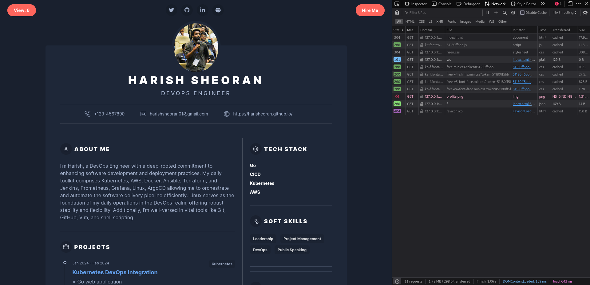
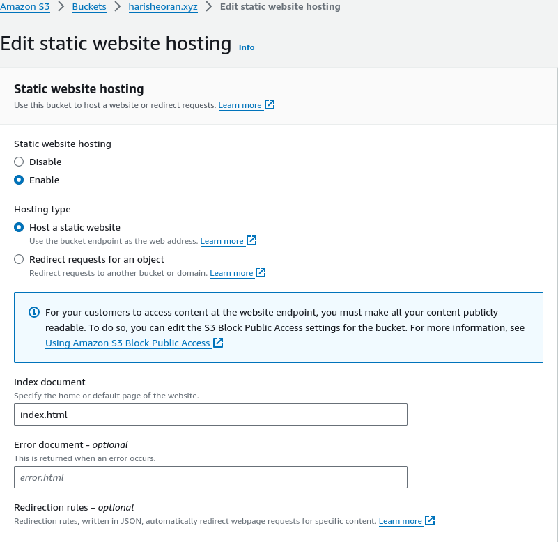
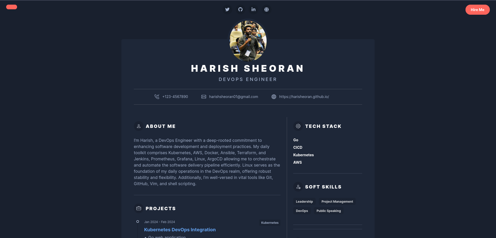
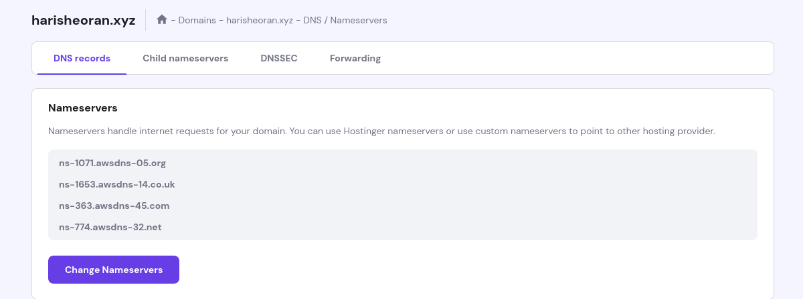

## Version v1.0.0



**About Project**

- Developed a professional resume website hosted on AWS, utilizing various AWS services for robustness and security.
- Leveraged AWS CloudFront CDN for efficient content delivery and AWS S3 bucket for hosting static website content, ensuring scalability and reliability.
- Implemented HTTPS protocol for enhanced security, supported by SSL/TLS certificate managed by AWS Certificate Manager.
- Managed DNS with AWS Route 53 for seamless domain management and resolution.
- Engineered a view tracking API using Go language, integrated with AWS DynamoDB for efficient data storage and retrieval.
- Containerized the View Tracking API using Docker for streamlined deployment and scalability.
- Orchestrated deployment pipeline on AWS utilizing AWS CodePipeline, CodeBuild, and CodeDeploy for automated building, testing, and deployment of the API Docker image.
- Employed various AWS services including IAM Roles and IAM Users for secure access management and authorization.


## Source Code



## Full Demo

---



> View full [Playlist](https://www.youtube.com/playlist?list=PLr8r2M2i9qsUfPB05J6yZhTh9QhiUVzQT).


## Build Website
Build a simple static Resume Website. I used this [Bootstrap Template](https://themes.3rdwavemedia.com/bootstrap-templates/resume/risen-free-bootstrap-5-dark-mode-resume-cv-template-for-developers/).

Here is my resume website [code](https://github.com/harisheoran/AWS-Cloud-Resume/tree/main/website).

## Website Hosting
Host the content on S3 Bucket
- Create a S3 Bucket as same name as you Domain name.
- Remove check from ***Block Public Access*** .
- Upload all the website files.
- Enable Static Website hosting.
    - Go to ***Properties*** > ***Static website hosting***
    - Enable it & fill ***Index Document***
        
    - Go to the URL it has created, you will get 403 error
        WHY? What happens?
        - We need to allow to access S3 by defining Bucket Policy
        ```
        {
            "Version": "2012-10-17",
            "Statement": [
                {
                    "Sid": "AddPerm",
                    "Effect": "Allow",
                    "Principal": "*",
                    "Action": "s3:GetObject",
                    "Resource": "arn:aws:s3:::YOUR_BUCKET_NAME/*"
                }
            ]
        }
        ```

    - Now visit the Static website URL of S3 bucket, website is accessible now
    


> **Issue :** We unchecked the ***Block Public Access***, which makes the S3 bucket's content accessible to everyone even to hackers which is an security issue.

## Why do we need Cloudfront?
Now our website is puclicly accessible, why do we need the Cloudfront.

CloudFront is a Content Delivery Network(CDN) service also provided by AWS, it enables users to deliver content globally with low latency, high data transfer speed, and securely delivered.
leveraging AWS edge locations around the world to cache and deliver content from the nearest location to the user, reducing latency and improving performance.
It also offers features such as SSL/TLS encryption, access controls, and real-time metrics.

> **Issue :** Our Website is not secure, it is using ***http*** protocol


- First, check the ***Block Public Access*** on S3 bucket.
- Create a SSL certificate using *AWS Certificate Manager*, create this certificate in North Verginia region.
- Create a CNAME record for this certificate in Hosted Zone.

> ***Must Read*** :  [Understanding DNS and Amazon's Route 53 Cloud Service](https://dev.to/aws-builders/understanding-dns-and-amazons-route-53-cloud-service-a-beginners-introduction-4jkc)


- Create Cloudfront Distribution
Follow this [blog](https://blog.tericcabrel.com/host-static-website-aws-s3-cloudfront/) 
After creating the CDN, add the Bucket policy (CDN will provide you after creating it) to S3 bucket, so that you can not view content of S3 bucket without bypassing the CDN.
- Create CNAME record with SSL certificate while creating the CDN, so it can use HTTPS protocol.


Visit the CDN url, our resume website is live now, but it is not using our Domain name.

## Route 53
To manage our DNS records.
- Create a Hosted Zone.
- Add the Nameservers of Hosted Zone to the Domain Provider Nameservers.
    

- Create a ***A Record*** in hosted zone for *Alias* to redirect the request from domain name to CloudFront Distribution.

## CI pipeline for frontend Code.
We have to upload modified files to S3 bucket and remove the previous ones.

- Using Github Actions.
- Do not use AWS credentials publicly, use them as secret variables.
```
name: Push to S3

on: [push]

jobs:
  deploy:
    runs-on: ubuntu-latest
    steps:
      - name: Checkout
        uses: actions/checkout@v4
      - name: Setup AWS CLI
        uses: aws-actions/configure-aws-credentials@v4
        with:
          aws-access-key-id: ${{ secrets.AWS_ACCESS_KEY_ID }}
          aws-secret-access-key: ${{ secrets.AWS_SECRET_ACCESS_KEY }}
          aws-region: ${{ secrets.AWS_REGION }}
      - name: Sync files to S3 bucket
        run: |
          aws s3 sync ./website s3://harisheoran.xyz --delete
```

## View Tracking API
API is build using Go, Gin Framework and AWS SDK v2. It uses AWS Dynamo DB to store the views.

***Working*** : When we send a GET request on "/" endpoint, it fetch the current views and add one more to it and save it to the database.

> [CRUD operations in Dynamo DB with GO](https://medium.com/deliveryherotechhub/dynamodb-with-aws-sdk-go-v2-part-2-crud-operations-3da68c2f:431f)


### Containerize the API
Using Go lang as base image, download the dependencies and build a executable file and run it.

```
FROM golang:1.22

WORKDIR /app

COPY go.* ./

RUN go mod download

COPY . .

RUN mkdir build

RUN CGO_ENABLED=0 GOOS=linux go build -a -installsuffix cgo -o build/main .

EXPOSE 4000

ENTRYPOINT [ "./build/main" ]
```

***My learning & mistakes during building docker image*** 
- Localhost is the localhost of docker itself not the host machine.
- Multistage Docker build issue - Can't access the shell of container.
- Docker Volume helps a lot 
    - In development to sync local directory with container
    - Named Volume (Anonymous Volumes) help in not syncing the container's specific directory

> Bash Script is a must skill to have - $(pwd)

```
 docker container run -v $(pwd):/app -v name:/app/main -d -p 4000:4000 --env-file ./.env view_api_img
```
- Checking the logs of the container. 
- Setting the environment for container.

### CI pipline using AWS CodeBuild
***Purpose***: To build the API image and push to Docker Hub Registry.

- Create an IAM Role.
- Create a Group for the project and attach the policy for *AWS CODEBUILD* full access.
- Creae a user and add to the group and attach Policies.
    - List IAM Role (To attach it in Code build service role)
    - To pass a role to a service (here we are giving role to our CodeBuild service). 
        
- ***Pipeline***: Checkout the code from Github Repository and use Dockerfile to build the image and push to Docker Hub using Docker Credentials.
- Connect to the Github account.
-  Need a Service Role -
    - WHY? : So that CodeBuild can perform action on your behalf.
    - How it works: First for which service you need this role and give it permission(Attach policies) for what it is going to do like in our case it need to access *AWS Systems Manager Parameter store*. 


- ***Buildspec file***: Define how your CI is going to do.

    Steps:
    - Login to Docker Hub, build the image and push the image
    - Credentials: Store them in *AWS Systems Manager Parameter store*. 
    - Logs are very important, so use the *Cloudwatch* logs.
    - Store this file in root directory.

        ```
        # buildspec.yml
        version: 0.2
        env:
            parameter-store:
                DOCKER_USERNAME: docker_username
                DOCKER_PASSWORD: docker_password
                DOCKER_URL: docker_url
        phases:
            build:
                commands:
                    - cd tracker_api/
                    - echo $DOCKER_PASSWORD | docker login -u $DOCKER_USERNAME --password-stdin $DOCKER_URL
                    - docker build -t "$DOCKER_USERNAME/view_api_img:latest" .
                    - docker push "$DOCKER_USERNAME/view_api_img:latest"
            post_build:
                commands:
                    - echo "Successfully pushed to Docker hub Registry"
        artifacts:
            files:
                - '**/*'
            name: my-artifact
        ```

### CD pipeline using AWS CodeDeploy
***Purpose***: To deploy and run the latest code of application on target compute platform.

> Is it looking for change in the codebase?
> Is it invoked by AWS Pipeline?
    
- Create Target Compute > EC2 instance.
- First, go to CodeDeploy > Applications > Create application and create an application, choose the EC2 as compute platform.
- Create Deployment Group.
- Install the [CodeDeploy agent](https://docs.aws.amazon.com/codedeploy/latest/userguide/codedeploy-agent-operations-install-ubuntu.html) on EC2.
- Why do we need CodeDeploy agent? ; It automates code deployments to any instance, including Amazon EC2 instances and instances running on EC2.
- Attach **Tags** to the EC2 instance. WHY? : Create all the resources of one project under one tag, helps in filtering the AWS resources. Here, we need tag for the code deploy service to id the target EC2 instance, we can assign single or multiple ec2 instances using tags.
- Now, we need a permissions - 
    - As, our target EC2 instance going to talk to Code Depoly and vice versa.
    - So, create two service roles, for Code Deploy and EC2.

- Add another IAM policy to our group to view **Tags** Keys and values.
- Finally create the Deployment.
- Upload our .env file on EC2 using [SSH](https://linuxhandbook.com/transfer-files-ssh/) . It stores the AWS Credentials as API is using Dynamo DB.

- **Depolyment Group**
    - Create a Deployment Group.

- Create a **appspec.yml**
    - Here, we define how we want to deploy and run the application, need two scripts to start and stop the container.
```
# appspec.yml
version: 0.0
os: linux

hooks:
  ApplicationStop:
    - location: scripts/stop_container.sh
      timeout: 300
      runas: root

  AfterInstall:
    - location: scripts/start_container.sh
      timeout: 300
      runas: root
```


## Running the API

- Run Migration First from container shell to create the *AWS Dynamo DB* Table.

```
docker exec -it <docker container id> bash
go run migrations/migrations.go
```


## ERRORS

1. **AWS CodeBuild**
    CodeDeploy agent was not able to receive the lifecycle event. Check the CodeDeploy agent logs on your host and make sure the agent is running and can connect to the CodeDeploy server.
    
    **SOLUTION**: 
    - Check Logs at /var/log/aws/codedeploy-agent
    - Restart codedeploy agent service
    - Check IAM role policies for Code Deploy and EC2
       
2. **AWS CodePipeline**
    Unable to create role
    - for primary source and source version arn:aws:s3:::codepipeline-ap-south-1-972545925755/view_tracking_pipeli/SourceArti/Od8R23
                    
    **SOLUTION**: 
    - https://docs.aws.amazon.com/codepipeline/latest/userguide/troubleshooting.html#codebuild-role-connections
                            
    - https://stackoverflow.com/questions/64300151/aws-codebuild-failed-client-error-authorization-failed-for-primary-source-and-s
                    
    
3. **AWS CodeDeploy** during running the CodePipeline
    Same Issue with Code Deploy - Unable to access the artifact with Amazon S3 object key 'view_tracking_pipeli/BuildArtif/mOIyXyD' located in the Amazon S3 artifact bucket 'codepipeline-ap-south-1-972545925755'. The provided role does not have sufficient permissions.

    **SOLUTION**:
    - Uploading Build Artifact Error - https://medium.com/@shanikae/insufficient-permissions-unable-to-access-the-artifact-with-amazon-s3-247f27e6cdc3           

4. **Cache Invalidation issue of CloudFront**
    Cache Invaildation Issue: Latest changes are unavailable to the users because the contents are cached at the CloudFront edge locations. The default caching policy keeps the contents cached for up to 24 hours (TTL).

    **SOLUTION**:
    - https://docs.aws.amazon.com/AmazonCloudFront/latest/DeveloperGuide/Invalidation.html#invalidating-objects-api

5. **Request get blocked from resume website to the API**

    The page at 'https://harisheoran.xyz/' was loaded over HTTPS, but requested an insecure resource 'http://13.232.228.220:4000/'. This request has been blocked; the content must be served over HTTPS.

    **SOLUTION**:

    So, we have to set up a proxy which forward the request to port 4000 and attach a TLS certificate so that it uses HTTPS protocol.
    - Set up Reverse Proxy using Nginx - https://phoenixnap.com/kb/nginx-reverse-proxy
    - Installed the TLS cert using [*Certbot*](https://certbot.eff.org/)
    - Create **A** record in Domain Management with EC2 IP address.

---

**QUESTIONS**
- Why do we need the Deployment Groups?
- Why do we need to upload Artifacts to S3 bucket during AWS CodePipeline 

---

#### Blogs refrences 
- [AWS Refrence for hosting simple static Website using S3](https://docs.aws.amazon.com/AmazonS3/latest/userguide/WebsiteHosting.html)

- [DNS & Route 53](https://dev.to/aws-builders/understanding-dns-and-amazons-route-53-cloud-service-a-beginners-introduction-4jkc)

- [Hosting Website](https://dev.to/aws-builders/guide-to-hosting-a-static-website-on-aws-using-s3-cloudfront-and-route53-with-just-7-steps-220b)

- [Hosting Website with CDN OAI](https://blog.tericcabrel.com/host-static-website-aws-s3-cloudfront/)

- [What is CloudFront](https://docs.aws.amazon.com/AmazonCloudFront/latest/DeveloperGuide/Introduction.html)

- [Dynamo DB with GO](https://medium.com/deliveryherotechhub/dynamodb-with-aws-sdk-go-v2-part-2-crud-operations-3da68c2f:431f)
