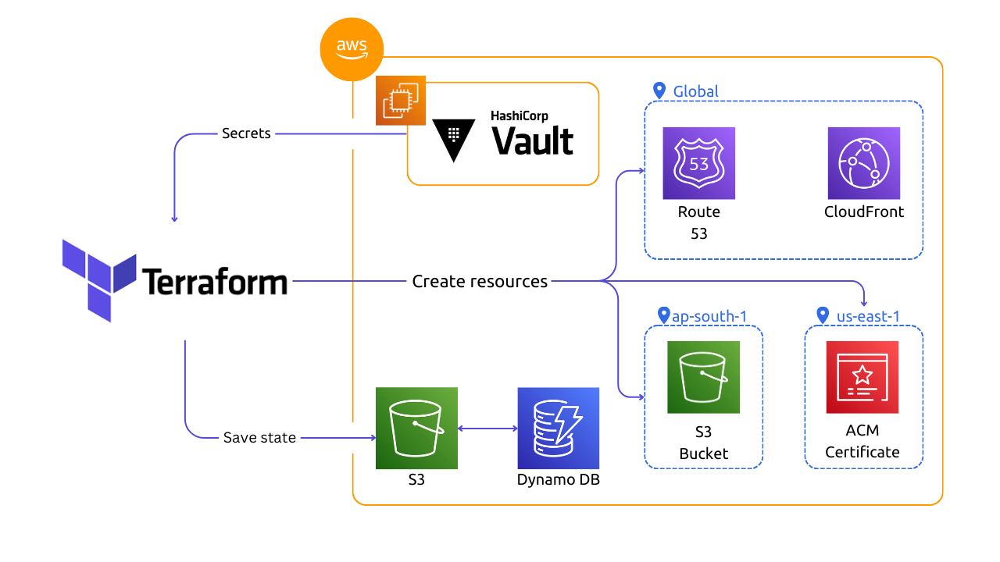
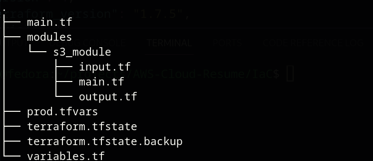

This project is part of AWS Resume Project. In this part we are going to create Infrastructure on AWS using ***Terraform***.

Workflow of the project -


## Source Code


### How to run the Project?
- Clone the repository.
- Create an S3 bucket and Dynamo DB for remote backend with lock mechanism. Read this [blog](https://medium.com/@aaloktrivedi/configuring-a-terraform-remote-backend-with-s3-and-dynamodb-ebcefa8432ea)
- Setup Hashicorp Vault.
    - Create EC2 instance, go to the [vault directory](https://github.com/harisheoran/AWS-Cloud-Resume/tree/main/vault) and create the infrastructure using Terraform.
   
   ```terraform init && terraform apply ```
    
    - Upload both scripts on the ec2 server
    
    ``` scp -i <aws key pair> install_vault.sh vault.sh ubuntu@<ip address>:/home/ubuntu/ ```
    
    - Change the permissions of both scripts
    
    ``` chmod 700 install_vault.sh vault.sh ```
    
    - Execute the scripts in order  
        1. ``` ./install_vault.sh```
        2. ``` ./vault.sh```

- Create main resources, go to *iac* directory and apply the terraform
   
  - Create ***terraform.tfvars*** and provide the values
```
bucket_domain=""                # Domain name
domain=""                       # Domain name
role_id = ""                    # Role ID of hashicorp Vault
secret_id = ""                  # Secret ID of Hashicorp Vault
main_region = ""                # AWS region, you can choose whichever you like
cert_region = ""                # AWS region for creating SSL/TLS certificate, must be in North Vergina
s3_remote_backend_name = ""     # S3 bucket name in which you want to upload terraform state file
dynamo_db_remote_backend = ""   # Dynamo DB table name for remote backend
remote_backend_region = ""      # Remote backend region
env = ""                        # prod, dev, test
```

- Initialize the terraform  ```terraform init```
- Apply the terraform  ```terraform apply```
    - set *is_zone* to true for first time.
    - Now copy output Nameservers and paste them in your Administrative DNS server(From which you bought the domain name). 
    - now run again ```terraform apply``` and set *is_zone* to false to create rest of the resources.

- Visit your Domain name.

---


## Infrastructure Requirements
1. S3 bucket (for hosting website files)
    - Upload files
    - Enable static website hosting
    - Attach Bucket Policy

2. Create a SSL/TLS certificate for website
    - Use AWS Certificate Manager (ACM)
    - Create this in North Verginia region 

3. Create Route 53 hosted zone and create CNAME record of certificate.

4. Create Cloudfront CDN and use S3 bucket as OAI
  - Attach Cert to it
  - Create *A* record for cdn url, alias to main Domain.


---

## Terraform
Terraform is a tool by Hashicorp for managing you infrastructure using code.
Define your infrasturctue in HCL.

### Benefits
- Easy to manage the infra with code.
- Works with major Cloud Providers.
- Support Hybrid Cloud.

### Working
1. Initialize the terraform
```
terraform init
```

2. Plan the infrastructure
```
terraform plan
```

3. Apply the infrastructure
```
terraform apply
```

> Lets understand the Terraform practically by creating infra on AWS. 

- First, we need to initialize the terraform and provide it the cloud service on which we want to create infra.
```
terraform {
  required_providers {
    aws = {
      source  = "hashicorp/aws"
      version = "~> 5.0"
    }
  }
}

# Configure the AWS Provider
provider "aws" {
  region = "us-east-1"
}
```
> ***terraform*** block is to configure the terraform with cloud provider.

> ***provider*** block is to configure the cloud with the region.


- Now initialise the terraform
```
terraform init
```


### Understand by creating a S3 bucket.

```
resource "aws_s3_bucket" "my-main-s3" {
  bucket = "harisheoran.xyz"

  tags = {
    Name        = "main"
    Environment = "prod"
  }
}
```

> ***resource*** block is to create resource on the cloud.

> ***aws_s3_object*** is Terraform resource type, which represents a cloud's resource or service or component.

> ***my-main-s3*** is the logical name of the resource. This allows you to refer to this specific instance of the resource within your Terraform configuration.

> ***{ }*** this block contains the configuration of the resource.

- Execute ``` terraform plan ```

It is a dry run, it show the logs of the infrastructure which is going to create.


- Finally, create the infrastructure.
```
terraform apply
```


## Terraform State
Terraform State is the brain of terraform, using the state it knows about all the resources it created. 
Terraform create a state file after creating the resources, it records the logs of resources it has created.

### Terraform State working
Terraform create state file when you execute ``` terraform apply ``` for the first time, it saves the info of all the resources you created. When you want to create more resources or update the existing one, you write the configuration and apply the changes, then it checks the state file and checks for existing resources, and compare it with the what it have to create or update and find the difference and update or create accordingly.

### Terraform State benfits
Let say we create an EC2 instance using Terraform and after that we want to add a tag to it.
- if state don't exist, Terraform has no idea that it already created an EC2 instance, so it'll create a new one.
- if state exist, it'll check first that EC2 instance is already created and it'll add tag to it.

### Terraform State Drawbacks
-
-


### Terrform State Solutions
-
-


### Terraform Modules?
Modules are like resuable functions of terraform to create infra.
If we have to create big infrastructure, then it would be mess to create all resources in one file, it'll be hard to understand and maintain the code by team.
So, we can create different modules for infra, and these modules don't have to exist in our repo, they can be hosted anywhere.

### How to create Modules?
- Create a new directory for each module
```
mkdir modules
mkdir modules/s3_bucket
```

- Create the terraform files inside the module normally as we did before.



- Define which module to use in root *main.tf*
```
module "s3_bucket" {
  source = "./modules/s3_module"
}

```

### Variables
Variables are like as the name suggest.

#### Input Variables
To Provide variables to terraform files
```
variable "bucket_name" {
  type = string
  description = "Bucket name same as Domain name."
  default = "harisheoran"
}

```


#### Output Variables
To get values after resource is successfully created or modified

```
output "website_address" {
  value = aws_s3_bucket.main_s3_bucket.website_endpoint
}

```

### How to pass values to input variables?
Many ways to do this, but standard way is using ***.tfvars*** file
Define input variable and provide values of those variable in tfvars and use it.

```
terraform apply -var-file=”prod.tfvars”
```

### Multi Region
Create SSL/TLS certificate using ACM in North Vergina Region.
- Attach an alias to each Provide block and attach refrence to resources while creating them.

```
# Configure the AWS Provider Region 1
provider "aws" {
  region = "ap-south-1"
  alias = "indian_region"
}

provider "aws" {
  region = "us-east-1"
  alias = "north_v_region"
}

module "s3" {
  source = "./modules/s3"
  bucket_name = var.bucket_name
  providers = {
    aws = aws.indian_region
  }
}

module "acm" {
  source = "./modules/acm"
  bucket_name = var.bucket_name
  providers = {
    aws = aws.north_v_region
  }
}
```


### Secret Manager: Hashicorp Vault
- [Setup on Vault](https://dev.to/shrihariharidass/terraform-hashicorp-vault-integration-seamless-secrets-management-4jkk)

- Vault has role similiar to IAM Role.

So, create a App Role so that terraform can access the vault, first create the policy and attach the policy to role.
Now, get the secret key and id (similiar to AWD secret key value)


## Conditionals in Terraform
Why do we need to use conditionals?
As I bought domain from another provider than AWS, so I have to create first Hosted zone and add Nameservers in my Hostinger Domain management, so that route 53 has permission to manage the DNS records for me. 

```
  count  = var.is_zone ? 0 : 1
```

- first_run is a boolean variable
- If var.is_zone is true, set count to 0 (don't create any instances).
- If var.is_zone is false, set count to 1 (create one resource).

## Depends
One module dependencies on another, like CDN requires S3 bucket.

```
depends_on = [ module.route53_hosted_zone, module.route53_hosted_zone, module.s3, module.cert]

```

## Errors
- Since you have a module call which is using the count meta-argument, that means you will have to either reference a specific index of the module (because it becomes a list).

```
  acm_cert_arn = module.cert[0].acm_cert_arn
```

## Terraform Workspaces?
-
-

---

**Blogs refrence**
- [Creating and validating ACM certificates with Terraform  ](https://headforthe.cloud/article/managing-acm-with-terraform/)

- [Remote Backend for state](https://medium.com/@aaloktrivedi/configuring-a-terraform-remote-backend-with-s3-and-dynamodb-ebcefa8432ea)
