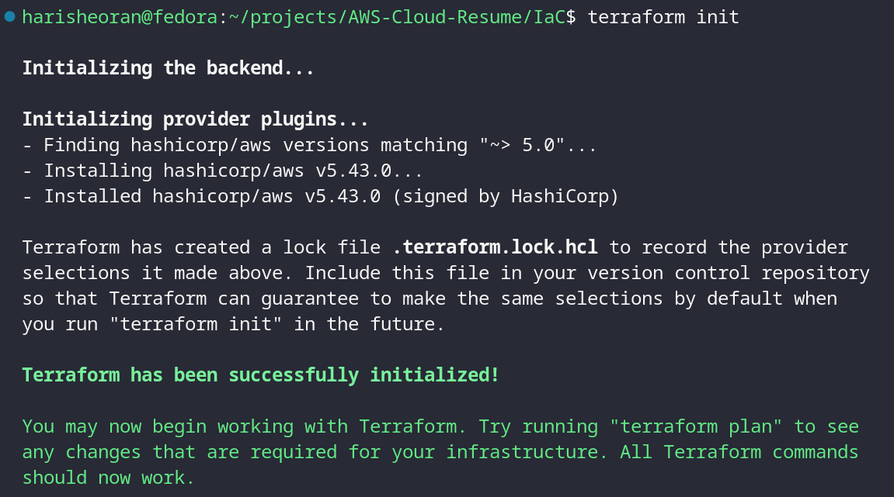
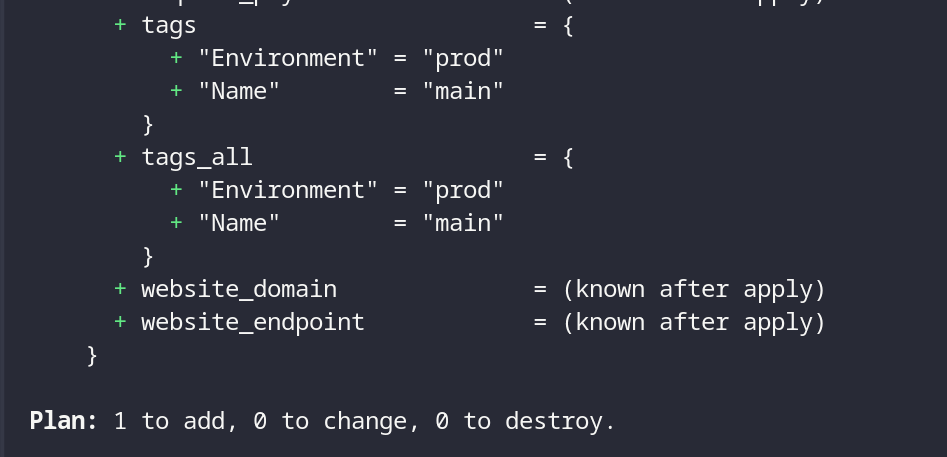
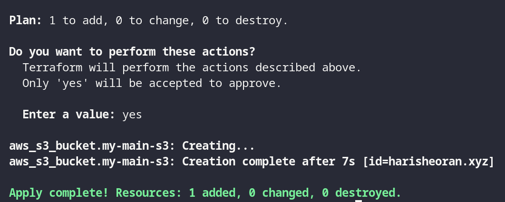

This version includes Creating AWS infrastructure using Terraform

## Terraform
Terraform is a tool by Hashicorp for managing you infrastructure using code.
Define your infrasturctue in HCL.

### Benefits
- Easy to manage the infra with code.
- Works with major Cloud Providers.
- Support Hybrid Cloud.

### Working
1. Initialize the terraform
```
terraform init
```

2. Plan the infrastructure
```
terraform plan
```

3. Apply the infrastructure
```
terraform apply
```

> Lets understand the Terraform practically by creating infra on AWS. 

## Infrastructure Requirements
1. S3 bucket (for hosting website files)
    - Upload files
    - Enable static website hosting
    - Attach Bucket Policy

- First, we need to initialize the terraform and provide it the cloud service on which we want to create infra.
```
terraform {
  required_providers {
    aws = {
      source  = "hashicorp/aws"
      version = "~> 5.0"
    }
  }
}

# Configure the AWS Provider
provider "aws" {
  region = "us-east-1"
}
```
> ***terraform*** block is to configure the terraform with cloud provider.

> ***provider*** block is to configure the cloud with the region.


- Now initialise the terraform
```
terraform init
```



- Create a simple S3 bucket.

```
resource "aws_s3_bucket" "my-main-s3" {
  bucket = "harisheoran.xyz"

  tags = {
    Name        = "main"
    Environment = "prod"
  }
}
```

> ***resource*** block is to create resource on the cloud.

> ***aws_s3_object*** is Terraform resource type, which represents a cloud's resource or service or component.

> ***my-main-s3*** is the logical name of the resource. This allows you to refer to this specific instance of the resource within your Terraform configuration.

> ***{ }*** this block contains the configuration of the resource.

- Execute ``` terraform plan ```

It is a dry run, it show the logs of the infrastructure which is going to create.



- Finally, create the infrastructure.
```
terraform apply
```



## Terraform State


## Terraform Modules?


## Terraform Workspaces?
