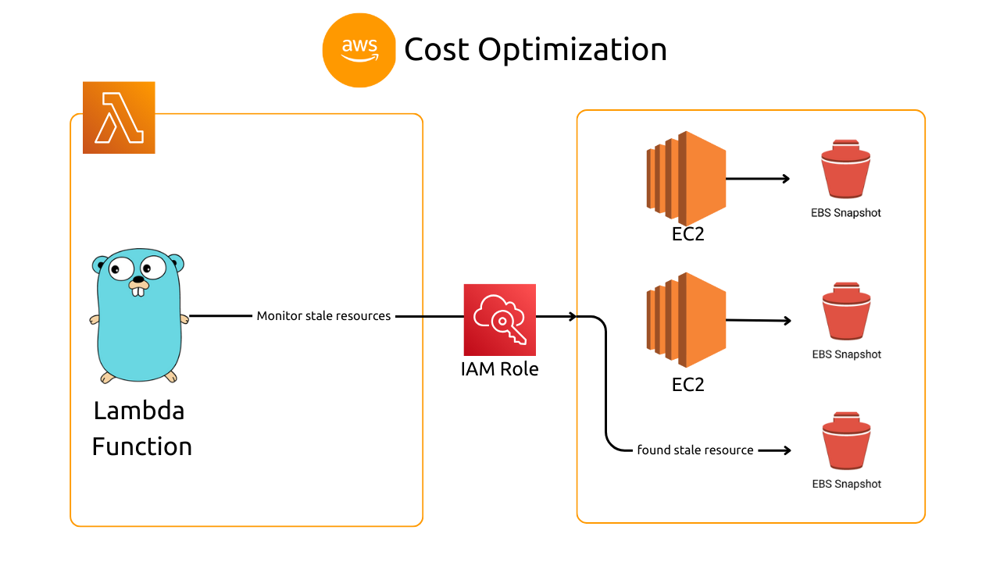
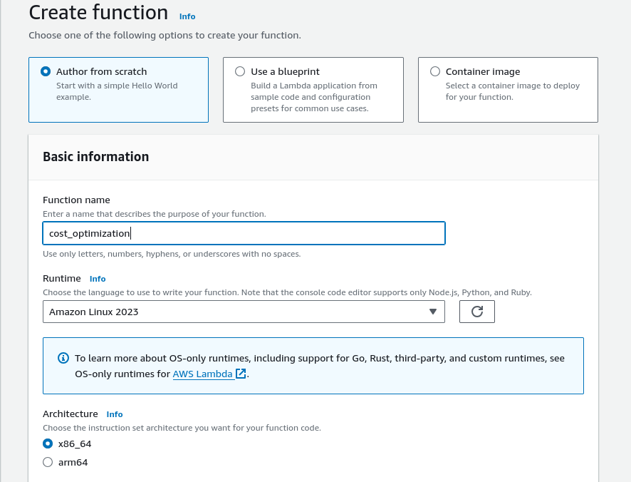
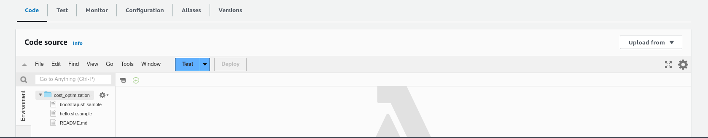
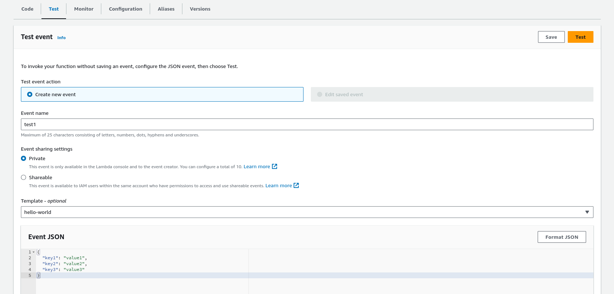
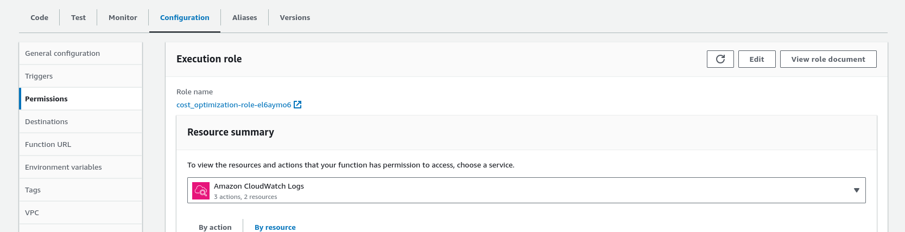
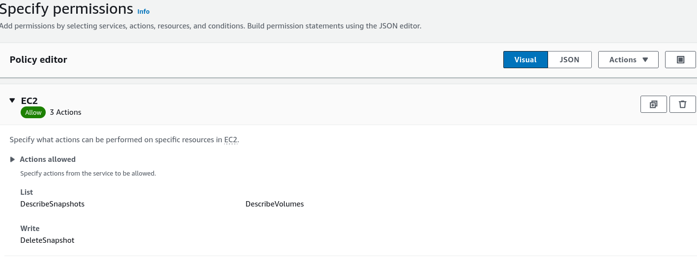

## AWS Cloud Cost Optimization: Monitoring and Eliminating Stale Resources

Managing cloud costs is crucial for any organization leveraging AWS services. Imagine you have EC2 instances with attached EBS volumes containing important data. You take regular snapshots for backups, but when you delete the EC2 instances and their volumes, you might forget about those snapshots. This oversight can lead to unnecessary costs, especially in large organizations where tracking such stale resources is challenging. In this blog, we'll explore an efficient AWS Lambda function designed to identify and eliminate these forgotten snapshots, helping you optimize your cloud expenditure.

### Source Code


### Demo



## AWS Lambda
AWS Lambda service provides serverless computing on which we can run our code as a Lambda function which triggers based on an event.

### Why Lambda?
AWS lambda is serverless which means it only runs when it is triggered and the rest of the time it sits idle, not utilizing any compute resource and it is auto-scalable also.

You can write lambda function in any language you choose, I am using Go language.

## Build it
Let's take the above scenario in which at the end we have stale snapshots which are not associated with volumes, basically costing us money.


### Solution
- First, get the Snapshot's volume ID and snapshot ID.
- Check that the volume exists or not using that volume ID
- if volume does not exist, delete that snapshot using snapshot ID.

### Code it
AWS provide AWS SDK for Go to interact with AWS resources.

- [Install AWS SDK v2](https://aws.github.io/aws-sdk-go-v2/docs/getting-started/#install-the-aws-sdk-for-go-v2)
- [Configure the ADK to send request](https://aws.github.io/aws-sdk-go-v2/docs/configuring-sdk/)
- [Install AWS Go lambda package](https://github.com/aws/aws-lambda-go)

We mainly use AWS EC2 service, so refer to [EC2 service package](https://pkg.go.dev/github.com/aws/aws-sdk-go-v2/service/ec2) for documentation.

- Get the Snapshot using ownerID (owner ID of the caller's AWS account, so as to get only our snapshots)
```
	// get owner ID of caller AWS account
	stsClient := sts.NewFromConfig(configs)
	callerId, err := stsClient.GetCallerIdentity(context.TODO(), &sts.GetCallerIdentityInput{})
	if err != nil {
		fmt.Println("ERROR", err)
	}
	ownerID := *callerId.Account

	// get snapshots Volume ID
	snapshot, err := client.DescribeSnapshots(context.TODO(), &ec2.DescribeSnapshotsInput{
		OwnerIds: []string{ownerID},
	})
	if err != nil {
		fmt.Println("ERROR", err)
	}
```

- get the Snapshot's volume ID and snapshot ID and send a request using that volume ID and catch the error type to check the stale snapshot and delete the snapshot using snapshot ID.

```
// check for stale snapshots: check for every snapshot's Volume ID, and check if exists
	for _, snap := range snapshot.Snapshots {
		snapID := *snap.SnapshotId
		volID := *snap.VolumeId

		_, err := client.DescribeVolumes(context.TODO(), &ec2.DescribeVolumesInput{
			VolumeIds: []string{volID},
		})
		if err != nil {
			var volErr smithy.APIError
			if errors.As(err, &volErr) {
				switch volErr.ErrorCode() {
				case "InvalidVolume.NotFound":
					fmt.Println("Deleted the %s stale snapshot", snapID)
					deleteStaleSnapshots(snapID, client)
				default:
					fmt.Printf("ERROR", volErr)
				}
			} else {
				fmt.Printf("Error in checking volume")
			}
		} else {
			fmt.Println("No stale snapshots available.")
		}
	}

func deleteStaleSnapshots(snapID string, client *ec2.Client) {
	output, err := client.DeleteSnapshot(context.TODO(), &ec2.DeleteSnapshotInput{
		SnapshotId: &snapID,
	})

	if err != nil {
		fmt.Println("ERROR", err)
	}
	fmt.Println(*output)
}
```

- Start the lambda from the main function.
```
func main() {
	lambda.Start(awsCostOptimize)
}
```

## Create a Lambda function
- Go to Lambda service in the AWS console(you also can use Terraform, which I have already created, check the source code under *iac* directory)



- Create a binary of the code, lambda only accepts the name *bootstrap*

```CGO_ENABLED=0 go build -o bootstrap main.go```

- Create a zip file to upload code to lambda.

```zip lambda-handler.zip bootstrap```

- Upload the zip file


- Try to run it from the *test* section


After running, it failed, why? Let's check the logs.

This is an error -
```
ERROR operation error EC2: DescribeSnapshots, https response error StatusCode: 403,
RequestID: 63f1db48-7100-4025-88e4-b914523d871a,
api error UnauthorizedOperation: You are not authorized to perform this operation.
User: arn:aws:sts::637423604544:assumed-role/cost_optimization-role-el6aymo6/cost_optimization is not authorized to perform: ec2:DescribeSnapshots because no identity-based policy allows the ec2:DescribeSnapshots action
```

By looking at the error, we can see that we are not authorized to perform this action.

> ***Solution***

By default AWS doesn't allow any service to talk to another AWS service which in our case Lambda service is trying to talk to the AWS EC2 service, this is for security.

> ***IAM Roles***

We have to assign IAM roles to Lambda which has permission to perform our desired action on EC2 service.

- Go to configuration > permission and click on *role_name* link


- Create an Inline policy and allow these 3 permissions on the EC2 Service


- Test the function again and it ran successfully.

- Try to create some ec2 instances and attach some snapshots and then delete those ec2 instances and you will be left with stale snapshots, now try to run the lambda function, you can do it manually or schedule a cron job.

This Cost optimization technique can be applied to other scenario also.
