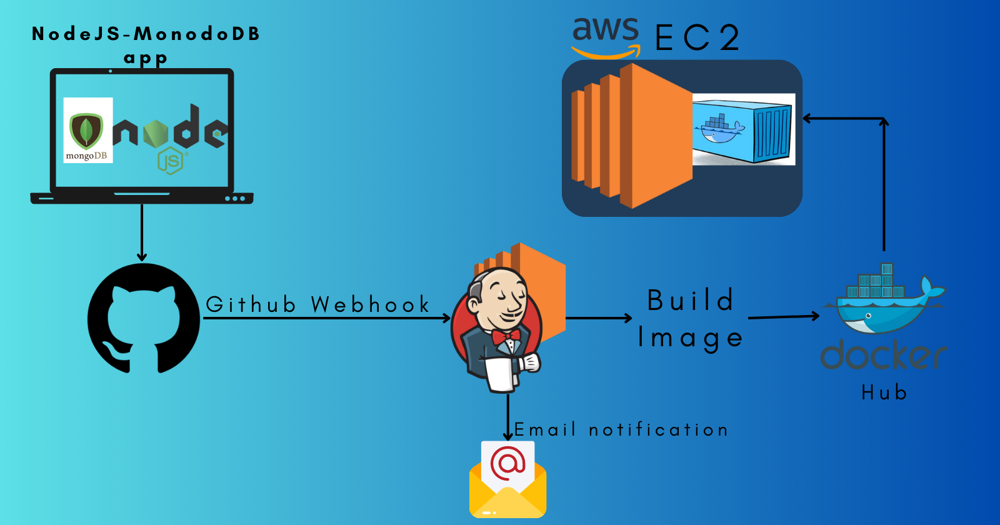

## Programmer Server

Micro Blog website for developers.


## Workflow


## Tech Stack and tools

### Application
- Node JS
- Express JS
- Mongo DB
- Bootstrap 5

### DevOps
- Docker
- Docker Compose
- VCS (Git & Github)
- Terraform
- Ansible
- Nginx
- AWS EC2
- Jenkins

# Next Goals
- Contianer Orchestration using k8s

---

# Development Setup

## How to run the project locally
- Install npm packages
```
npm install
```

- Create a .env file for environment variables

```
NODE_ENV=
MONGO_USER=
MONGO_PASSWORD=
SESSION_SECRET=
MONGO_INITDB_ROOT_USERNAME=
MONGO_INITDB_ROOT_PASSWORD=
```

## Build the Docker image and run the container

```
sudo docker-compose -f docker-compose.yml -f docker-compose.dev.yml up -d
```

You can access the application on _localhost:3000_
and hit the _/blogserver_ .

# Production Setup

## Infrastructure as Code
### Run the Terrafrom File to launch 2 ec2 instances

```
cd terraform
```
```
terraform init
```

```
terraform apply
```

It'll output 2 IP addresses, copy them(You'll need to configure our ec2 instances).

## Configuration  Management

### For Pipeline
Using Ansible
- First, we configure the Pipeline server

```
cd ansible
```
Paste the IP address in ***inventory.ini***

```
ansible-playbook -i ./inventory.ini ./pipeline.yml 

```
It'll install Jenkins on EC2 and start serving on port 8080.

Now install basic plugins and some additional plugins like 
- Github Integration


### For main server
Now, configure the main ec2 instance, execute the following command
```
ansible-playbook -i ./inventory.ini ./run_app.yml 

```

Web application will start serving at public ip address of ec2 instance.