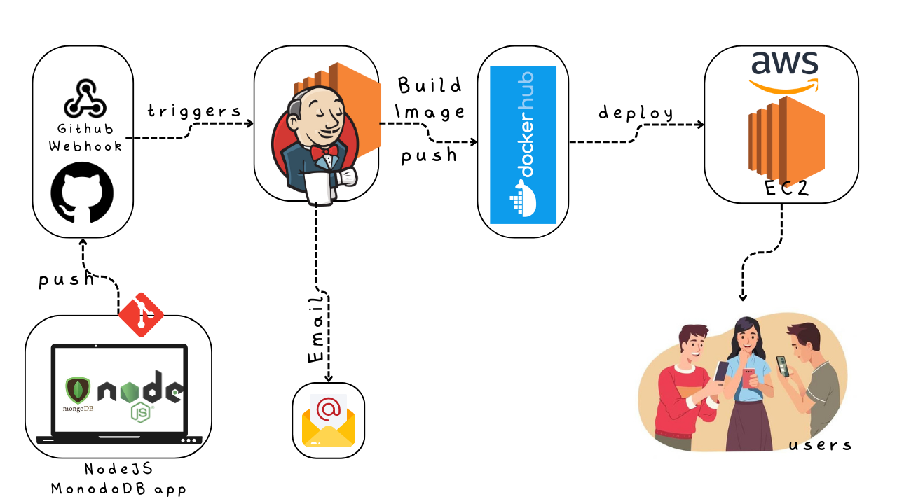

## Programmer Server

Micro Blog website for developers.

## Workflow


## Tech Stack and tools

### Application
- Node JS
- Express JS
- Mongo DB
- Bootstrap 5

### DevOps
- Docker
- Docker Compose
- VCS (Git & Github)
- Terraform
- Ansible
- Nginx
- AWS EC2
- Jenkins

# Development Setup

## How to run the project locally
- Install npm packages
```
npm install
```

- Create a .env file for environment variables

```
NODE_ENV=
MONGO_USER=
MONGO_PASSWORD=
SESSION_SECRET=
MONGO_INITDB_ROOT_USERNAME=
MONGO_INITDB_ROOT_PASSWORD=
```

## Build the Docker image and run the container

```
sudo docker-compose -f docker-compose.yml -f docker-compose.dev.yml up -d
```

You can access the application on _localhost:3000_
and hit the _/blogserver_ .

# Production Setup on EC2 instance
### Launch the EC2 instance,
- Free version is enough(Ubuntu t2 micro). 
- SSH into EC2 instance.

### Install required packages
Setup Docker
- Install Docker & add user to docker group

```
sudo apt update
sudo apt install docker.io
```

- Start Docker service
```
sudo systemctl restart docker
```
- Check status of docker service
```
sudo systemctl status docker
```

- Install Docker compose
 Read this blog [here](https://linuxize.com/post/how-to-install-and-use-docker-compose-on-ubuntu-20-04/).

### Set up environment variables
- Create a *.env* file
same as development setop (check above)(I am using vim)

- Edit the *.profile* file
```
set -o allexport; source /home/ubuntu/.env; set +o allexport
``` 
save the file and exit from ssh connection, so that changes can load.

- Check the environment variables,
```
printenv
```


### Clone the repository
```
git clone https://github.com/harisheoran/programmer-server.git
```

### Spin up the contaniner
```
docker-compose -f docker-compose.yml -f docker-compose.prod.yml up -d
```


### Edit the Inbound rules of EC2 instance.
So that we can access it from any ip address.
- Go to EC2 instance, **Security** > **Secuirty groups** > **Edit Inbound Rules**
Somthing like in below image( in our case, we'll have allow there)


- Copy the public ip address of your ec2 instance

Visit <public_ip>:80 to view the application.

