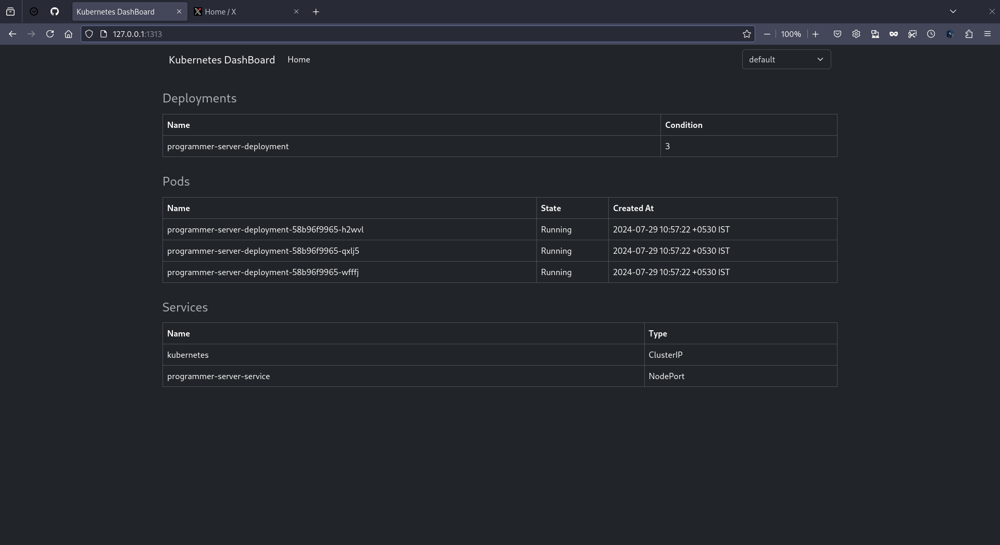

To monitor and visualize cluster resources efficiently.

## Current features
- View Pods
- View Services
- View Deployment

## Planned Features
https://github.com/harisheoran/k8s_dashboard/issues

## Source Code


## Demo

