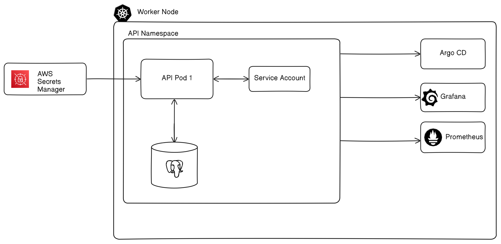

Today, we are going to deploy an API on Kubernetes with production standards.

We are going to deploy [Scale Mesh](https://harisheoran.github.io/projects/scale-mesh/), a vercel alternative to deploy your web apps with ease.

<details>
<summary> What we are going to learn during this deployment? 
</summary>
<br>

1. Pods
2. Deployments
3. Replica Set
4. Service
5. Namespace
6. Secrets
7. Ingress
8. Ingress Controller
9. Custom Resources
10. Custome Resource Defination
11. Custom Controller
12. Operators
13. Helm Charts
14. Service Account
15. OIDC
</details>

## About API

### Application Structure
This is a 2 tier application,
- *api-server* is the main API.
- *postgres db* is the primary database.

## Prerequiste
- Install 
    - AWS CLI
    - eksctl

## Deployment Architecture


## Create a Kubernetes Cluster
Create the Kubernetes cluster on your favourite cloud or even bare metal, I am choosing the 
AWS as I got some free credits :)

We are using *eksctl* cli tool to create the cluste, but you can use another tools like *Terraform*.


I am creating the cluster in a existing VPC, so need to provide the vpc and subnet details
- Create an *eks.yaml* and copy the content of this [snippet](https://gitlab.com/-/snippets/3763721/raw/main/eks.yaml?inline=false)

```
eksctl create cluster -f eks.yaml
```

Wait for a while... a liitle more while...

- Create a tag on subnet of your VPC, [so that the AWS Load Balancer controller can auto discover the subnets.](https://kubernetes-sigs.github.io/aws-load-balancer-controller/v2.1/deploy/subnet_discovery/)
    - Tag the public subnet- ```kubernetes.io/role/elb: 1```
    - Tag the private subnet- ```kubernetes.io/role/internal-elb: 1```


## Start Deploying

Let's begin the chaos!!!


### Setup
- Clone the [Scale Mesh Respository](https://gitlab.com/harisheoran/scale-mesh).
- Go the ***k8s*** directory, it contains all the YAML files.
```
cd ./scale-mesh/k8s
```

Export these 2 variables in your shell,
- Choose your region ```export REGION=ap-south-1```
- Choose the name of the cluster ```export CLUSTER_NAME=scale-mesh-test-cluster```

### Deployement Visualization.


....

### Create a namespace
Namespace is used to group resources within a cluster.
- It is not a network or security boundry.
- used to origanise the resources.

```
kubectl apply -f namespace.yaml
```

### Deploy the Database as Stateful Set

#### Why Stateful Set?
Pods are ephermeral in nature, means they can destroyed and created at any time, so stateless in nature also,
but database data is critical to our application, we can't just lose our users data, so we need a persistant disk to save the data to.

***Stateful Set***
A Stateful Set is a type of worload resource which is used to manage the deployement and scaling of pods where maintaining a stable and unique identity for each pod is necessary and where application needs persistance volumes such as database.

***Persistant Volume Claim(PVC)***

PVC is a request for storage, it consumes storage resources defined by Persistant Volume.
- Dynamically Provisioning: K8s automatically provision the a PV that matches the request,  This only works if a storage class is available and configured in the cluster.
- Binding: Once a PVC is bound to a PV, it remains bound until released or deleted explicitly.

***PersistentVolume (PV)***

A PersistentVolume (PV) is a storage resource in Kubernetes that provides an abstraction for how storage is provisioned and used.


#### Install the CSI driver on Cluster
The CSI specification provides a standard that enables connectivity between storage systems and container orchestration (CO) platforms. 

- The Container Storage Interface (CSI) driver in Kubernetes is necessary for enabling dynamic provisioning and management of storage resources from various storage providers in a standardized and portable way.

- Kubernetes natively supports a limited set of storage backends. The CSI standard allows external storage providers (like Amazon EBS, Google Persistent Disk, Ceph, NFS, and others) to be integrated easily without modifying the core Kubernetes codebase.

Install Container Storage interface in Worker node, so that it can support storage to our container, as our postgres db pod need storage for volumes.

```
eksctl create addon --name aws-ebs-csi-driver --cluster $CLUSTER_NAME --region ap-south-1
```

### Deploy the Postgres DB using Helm
Helm is a package manager for Kubernetes, we can install the package from Helm repositories, we can manager multiple releases of a single package(support rollback release also).

- Add the Postgres Helm repo
We are using Bitnami Helm repo for the Database.

```
helm repo add bitnami https://charts.bitnami.com/bitnami
```

- Install the Postgres DB

```
helm install maindb bitnami/postgresql --version 15.5.37 --create-namespace --values=values.yaml
```

IMAGE HERE

### Create the IAM policy 
- Create and attach an IAM policy to eks Node Role with permissions to:
	- EC3 Volumes permission to create and delete volumes
	- Create and describe EC2 tags

So that out worker node have permission to access the volumes and create some tags.

### Check the Postgres DB status

### Deploy the API 
- Create the env secrets for the API.
1. SESSION_SECRET
2. DATABASE URI

```
kubectl apply -f api-server-secrets.yaml
```

```
kubectl apply -f api-server.yaml
```

- ***Pods***
Pods are the running specification of a container or multiple containers.
- ***Deployment***
Deployment is a workload resources which deploy the pods using replica set controller which ensure that the desired state of the pod is the actual state of pod in the cluster. 

- ***Service***
Service is a method for exposing a network application that is running as one or more Pods in your cluster.

*Types*:
- NodePort
- ClusterIP
- Loadbalancer

### Create an IAM OIDC provider.
In an Amazon EKS (Elastic Kubernetes Service) environment, the IAM OIDC (OpenID Connect) provider is crucial for enabling Kubernetes workloads to authenticate and securely interact with AWS services. why it's needed and what it does:

- Fine-Grained Permissions for Pods:
In a Kubernetes cluster, workloads running in Pods may need to access AWS services like S3, DynamoDB, Secrets Manager, or others. Using the OIDC provider, you can associate IAM roles with specific Kubernetes service accounts. 

***How IAM role and K8s service account work together in EKS?***

A Kubernetes service account is created and annotated with an IAM role that provides permissions for AWS services.
IAM Role for Service Account (IRSA) integration allows the service account to assume the IAM role and use it to interact with AWS resources securely. This way, workloads running in your EKS cluster can access AWS services using the IAM role, while still using the service account for Kubernetes API interactions.

- Creating IAM Roles for Pods: You create IAM roles with specific policies for AWS services your Pods need to access. Each role includes a trust relationship that allows the OIDC provider to authenticate and authorize access.

> The OIDC provider acts as a bridge between the EKS cluster and AWS IAM, facilitating this authentication process.


```
eksctl utils associate-iam-oidc-provider \
--region $REGION \
--cluster $CLUSTER_NAME \
--approve
```

***Kubernetes Service Accounts***

A Kubernetes Service Account is an identity that is used by Pods to interact with the Kubernetes API. It provides a way for applications running in a Kubernetes cluster to authenticate to the cluster and make API calls (for example, to list resources, create or delete objects, etc.).

- Service accounts enable you to apply Role-Based Access Control (RBAC) policies
- Pod level authentication
- Secure Access


### Set up Ingress
Ingress exposes the HTTP, HTTPS routes from outside the cluster to the services within the cluster.
- Traffic routing is controlled by rules defined in Ingress resources.
- Types of routing
    - Host Based (DNS)
    - Path Based (/)

- Tag the public subnet- kubernetes.io/role/elb: 1
- Tag the private subnet- kubernetes.io/role/internal-elb: 1

Read more on how to set up Ingress Controller [here](https://docs.aws.amazon.com/eks/latest/userguide/lbc-helm.html).

- Install the IAM policy
```
curl -o iam-policy.json https://raw.githubusercontent.com/kubernetes-sigs/aws-load-balancer-controller/v2.8.2/docs/install/iam_policy.json 
```

- Create the IAM policy
```
aws iam create-policy \
--policy-name AWSLoadBalancerControllerIAMPolicy \
--policy-document file://iam-policy.json
```

- Create the service account and associate the IAM role
```
eksctl create iamserviceaccount \
--cluster=$CLUSTER_NAME \
--namespace=kube-system \
--name=aws-load-balancer-controller \
--attach-policy-arn=arn:aws:iam::<AWS_ACCOUNT_ID>:policy/AWSLoadBalancerControllerIAMPolicy \
--override-existing-serviceaccounts \
--region $REGION \      
--approve
```

- Add the Helm repo
```
helm repo add eks https://aws.github.io/eks-charts
```

- Install
```
helm install aws-load-balancer-controller eks/aws-load-balancer-controller -n kube-system --set clusterName=$CLUSTER_NAME --set serviceAccount.create=false --set serviceAccount.name=aws-load-balancer-controller --set region=$REGION --set vpcId=<vpc id of cluster>
```

- Wait for the installation of controller
```
kubectl get deploy -n kube-system -w
```

- Create the ingress resource
```
kubectl apply -f ingress.yaml
```

- Check the ingress resource to view the loadbalancer DNS
```
kubectl get ingress -n api-ns
```

- View logs of controller if alb is not created
```
kubectl logs -n kube-system -l app.kubernetes.io/name=aws-load-balancer-controller
```

### ERROR
We got an error, as we need to run the ECS task from the EKS cluster, we didn't attach any role & permission to it. 

```
handlers.go:89: Unable to Run the ECS TASK operation error ECS: RunTask, https response error StatusCode: 400, RequestID: 0d384199-4c27-4c57-b7f5-0bd0704fcae5, AccessDeniedException: 
```

***SOLUTION***:
Give permission to the API pod to access the ECS task.

```
{
    "Version": "2012-10-17",
    "Statement": [
        {
            "Sid": "VisualEditor0",
            "Effect": "Allow",
            "Action": [
                "ecs:SubmitTaskStateChange",
                "ecs:UpdateCluster",
                "ecs:UpdateClusterSettings",
                "ecs:StartTask",
                "ecs:DescribeTaskSets",
                "ecs:DescribeTaskDefinition",
                "ecs:DescribeClusters",
                "ecs:RunTask",
                "ecs:ListTasks",
                "ecs:ListTaskDefinitionFamilies",
                "ecs:StopTask",
                "ecs:UpdateServicePrimaryTaskSet",
                "ecs:DescribeTasks",
                "ecs:ListTaskDefinitions",
                "ecs:UpdateTaskSet",
                "ecs:CreateTaskSet",
                "ecs:ListClusters"
            ],
            "Resource": "*"
        },
        {
            "Sid": "VisualEditor1",
            "Effect": "Allow",
            "Action": "iam:PassRole",
            "Resource": [
                "arn:aws:iam::637423604544:role/ecsTaskExecutionRole",
                "arn:aws:iam::637423604544:role/scale-mesh-s3"
            ]
        }
      ]
}
```

> Don't forget to give the permission of IAM Pass role, as another service(EKS) is giving the role to ECS, so need permssion of assuming an IAM role


- Create a new service account to attach to the API pod.
```
kubectl create serviceaccount api-svc-account -n api-ns
```

- Attach the IAM policy to the service account.
```
eksctl create iamserviceaccount \
  --name api-svc-account \
  --namespace api-ns \
  --cluster $CLUSTER_NAME \
  --attach-policy-arn=arn:aws:iam::637423604544:policy/scale-mesh-ecs-task-for-eks \
  --override-existing-serviceaccounts \
  --region $REGION \
  --approve
```


## Continous Delivery
Setup [ArgoCD](https://argo-cd.readthedocs.io/en/stable/)


## Secrets Management
Currently, our api secrets are only encrypted using base64 which is not secures.
