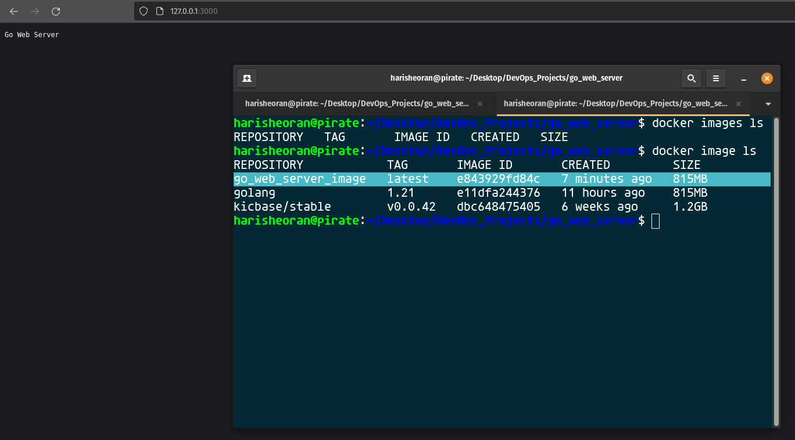
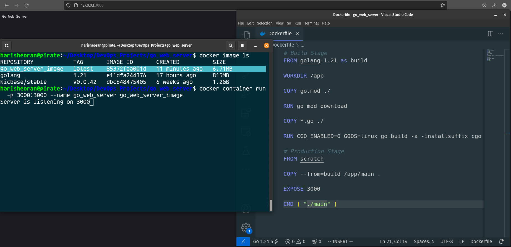

# Simple Web Server in GO

## Containerization using Multi-Stage Docker Build
Multi-Stage Docker Build or Distroless Image is a concept of creating image in multiple stages.

We build a docker image of a simple go web server using the concept of multi-stage docker build.


### The Evolution: From 815MB to 6.71MB 🚀

A simple Go web server docker image is 815 MB which is quite large.

Enter the magic of multi-stage Docker builds. By breaking down the build process into distinct stages, we've successfully trimmed down our image to a sleek 6.71MB. That's a jaw-dropping 99.17% reduction in size, making our deployment faster, more scalable, and resource-efficient.


How we build the image?
We divide this image into 2 stages, 
- Build Stage
- Production Stage

### Build Stage
In this stage, we take *golang* as Base image and install all the dependencies it needs and create a single binary and we don't define our entrypoint here.

```
FROM golang:1.21 as build

WORKDIR /app

COPY go.mod ./

RUN go mod download

COPY *.go ./

RUN CGO_ENABLED=0 GOOS=linux go build -a -installsuffix cgo -o main .

```

### Production Stage
In this stage we take *scratch* as Base image, it is a bare minimum image to run our binary.

And copy the binary build from build stage and execute it as an entrypoint.

> We don't need golang image in our production, we only need the executable binary.

```
FROM scratch

COPY --from=build /app/main .

EXPOSE 3000

CMD [ "./main" ]
```


#### The Command That Did the Magic ✨
Build the executable binary.

``` 
RUN CGO_ENABLED=0 GOOS=linux go build -a -installsuffix cgo -o main .
```
Breaking down the command:

- CGO_ENABLED=0: Disabling CGO for a statically linked binary.
- GOOS=linux: Targeting a Linux operating system for compatibility.
- go build -a -installsuffix cgo -o main .: Building a binary optimized for minimal size.

## Benefits Beyond Size: Security Boost 🛡️

Reducing image size isn't just about efficiency – it's also about security. Our final image contains only the essentials needed to run the Go application, minimizing attack surfaces and potential vulnerabilities. With fewer dependencies and a smaller footprint, our web server is now more resilient and secure in a production environment.