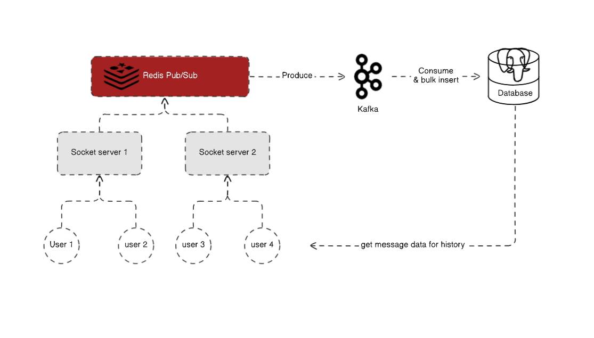

Introducing Chat System Enterprise, a cutting-edge, on-premises chat application designed specifically for companies that prioritize security, privacy, and control. It provides organizations with the ability to host their own private communication platform, ensuring sensitive data remains within their infrastructure. Tailored for corporate environments, it empowers teams to collaborate effectively while meeting strict compliance and security requirements.

## Source Code


## Architectue

## **Product Description**

Chat System Enterprise is a high-performance communication platform built to handle the demands of modern businesses. Engineered with scalability and reliability in mind, it features:

***Real-time Messaging***: Seamless group chat functionality.

***Scalability and Performance***: Built with GoLang, Kafka, and Redis to handle high user loads efficiently.

***Customization and Control***: Fully hostable on on-premises servers, providing complete data sovereignty.

## Techincal Stack

***Backend***: GoLang for high-performance and efficient server-side processing.

***Messaging and Data Handling***: Kafka and Redis for real-time and scalable messaging infrastructure.

***Deployment***: Designed for on-premises hosting to provide data control and compliance.
