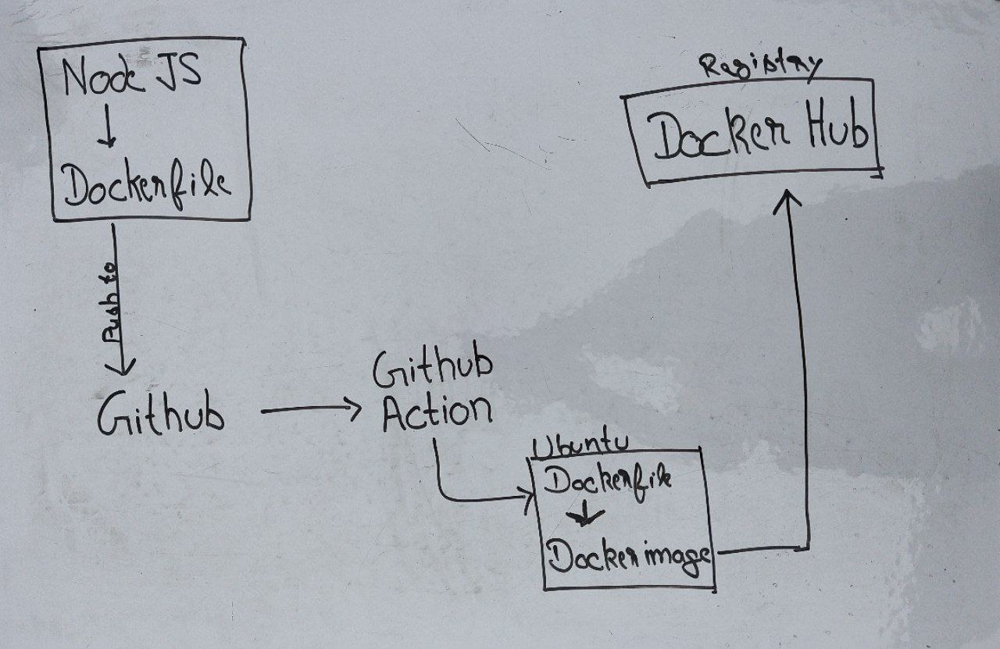

Containerization of a simple Node JS application using Docker and Docker Compose.

In this project, I have worked on
- Containerization using Docker
    - Dockerfile
    - Building Docker Images
    - Running container from the image.
- Volumes and Bind Mount
- Anonymous Volumes & Read Only volumes
- Envrionment variables of app
- Docker Compose
- Development & Production Dockerfiles
- Use of Bash Script
- Github Action to push the image on Docker Hub Registry

### Read the full detailed article on my [blog](https://harisheoran.hashnode.dev/docker-and-nodejs-a-love-story-with-containers-and-code-no-drama-just-dockerama).

### Project Workflow

### Docker Image on Docker Hub
 [harisheoran/my-node-app](https://hub.docker.com/repository/docker/harisheoran/my-node-app/general)

### Github Repository


