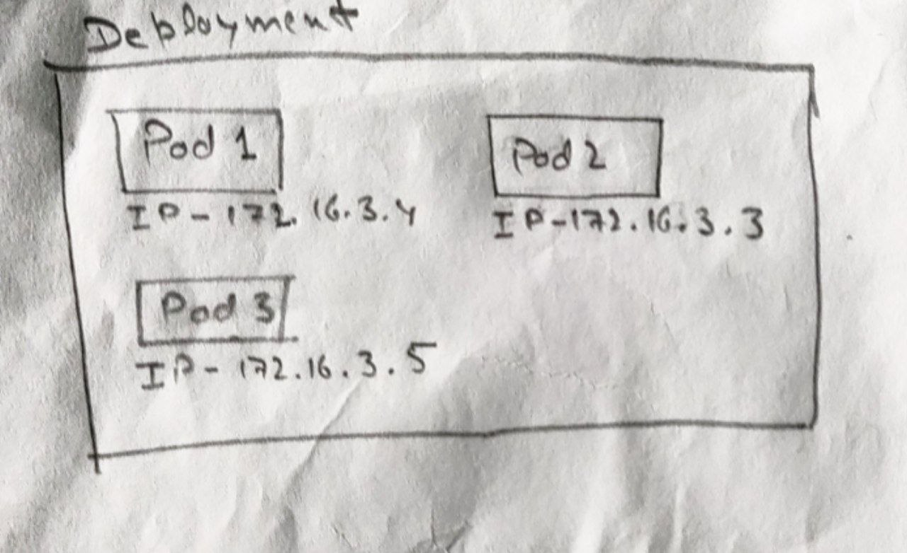
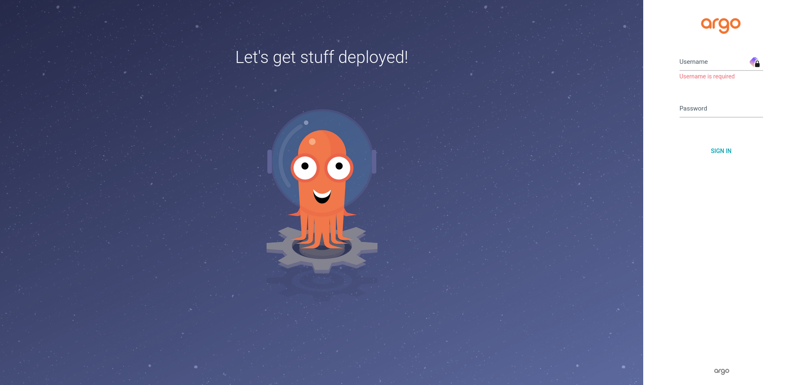
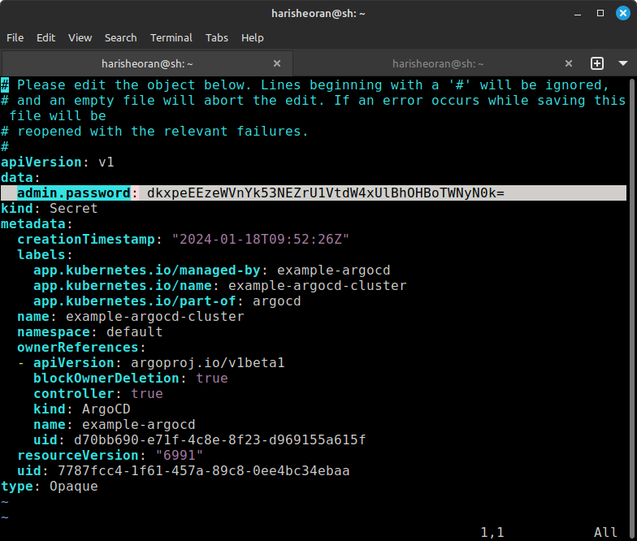
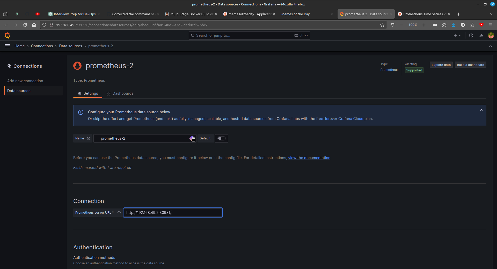

In this project, we'll dive into the practical world of code deployment, exploring the seamless integration of development and operations that powers modern software delivery. It focus on Kubernetes deployment. From transforming code into containerized brilliance to orchestrating the containers.

Here are project requirements.
<details>
<summary> Project Requirements
</summary>
<br>


1. **Source Code:**
   - Simple web application (static HTML or basic web server using a language of your choice).

2. **Version Control:**
   - Set up a Git repository.
   - Commit your initial code.

3. **Continuous Integration (CI):**
   - Choose a CI tool (Jenkins, GitLab CI, or GitHub Actions).
   - Configure the CI pipeline to trigger on each commit.
   - Include steps to:
      - Build your web application.
      - Run automated tests (if applicable).
      - Create a build artifact.

4. **Containerization:**
   - Use Docker to containerize your application.
   - Push Docker image to a container registry (Docker Hub, Google Container Registry, etc.).

5. **Continuous Deployment (CD):**
   - Set up a simple CD pipeline.
   - Deploy Docker container to a Kubernetes cluster.
      - Choose deployment target: local cluster (Minikube/kind), cloud service (EKS, GKE, AKS), or self-managed cluster.

6. **Monitoring (Optional):**
   - Integrate basic monitoring (e.g., Prometheus, logging).

Follow these steps, explaining your choices and demonstrating the flow. This assignment will showcase your skills in setting up a CI/CD pipeline and deploying applications to Kubernetes. If you have any questions along the way, feel free to ask!
</details>

## Project Workflow


## Source Code


## Project Demo


## Kubernetes Basics

### K8s Architecture


### Difference between Container, Pods, Deployment
<blockquote class="twitter-tweet"><p lang="en" dir="ltr">What is the difference between Container v/s Pod v/s Deployment?<br><br>Read here 👇 <a href="https://t.co/nHSuyAO0Hm">pic.twitter.com/nHSuyAO0Hm</a></p>&mdash; Harish Sheoran (@harisheoran) <a href="https://twitter.com/harisheoran/status/1749699318565478441?ref_src=twsrc%5Etfw">January 23, 2024</a></blockquote> <script async src="https://platform.twitter.com/widgets.js" charset="utf-8"></script>

1. Let's create a Pod


### K8s Service
Assume there is no service in k8s, we created 3 pods using deployment, kubeproxy assign Dynamic IP address to each pod,


Let's say if one pod goes down, Replica set controller is actively looking for desired state and actual state and it automatically creates the pod, but this time it have a new IP address, so now user is now unable to connect to that pod as this pod have new IP address. 

***Service*** comes into picture here and instead of assigning IP address to each pod, it assign IP to service and it access Pods via Service.


Now we are using Service and all request are coming to its IP address, *wait*, what if one of the pod goes down, and Replica Set Controller creates the pod again, now how service identifies the newly created pod.

***Service Discovery Mechanism*** 
This Mechanism assign labels to each pod and identifies them using selectors and even if they goes down, Replica Set Controller auto heal with same label again.

***Exposing to external world using Service***
1. Cluster IP
2. NodePort
3. Load Balancer


---
## First build a simple Web server 
You can choose the language of your choice for this task, I am using the Go language.
- Create a ***main.go*** file.

```
touch main.go
```

```
go mod init webserver
```

```
package main

import (
"fmt"
"net/http"
)

func main() {
  fs := http.FileServer(http.Dir("./static"))
  http.Handle("/", fs)

  port := 3000
  fmt.Printf("Server is listening on 3000")
  err := http.ListenAndServe(fmt.Sprintf(":%d", port), nil)
  if err != nil {
    fmt.Printf("Error: ", err)
  }
}
```

> This server is just serving a ***index.html***  and ***main.js*** file.

- Create a ***static*** directory for html and js files.
  - Here is [index.html](https://github.com/harisheoran/WebServer-Docker-CI-CD-k8s/blob/main/static/index.html)
  - Here is [main.js](https://github.com/harisheoran/WebServer-Docker-CI-CD-k8s/blob/main/static/main.js)
```
mkdir static

touch index.html main.js
```

- Run the website 
```
go run main.go
```

- Go to 127.0.0.1:3000


## Containerize your application using Docker
We use docker to containerize our application, let's write the ***Dockerfile***.

We are going to use the Multistage Docker build or Distroless Images.

>  Must read about [Multi-Stage Docker Build of GO web server](https://harisheoran.github.io/projects/multi_stage_docker_go/)

```
# Build stage
FROM golang:latest as build

WORKDIR /app
COPY go.mod ./
RUN go mod download

# Copy the necessary files of the application
COPY main.go .
COPY static ./static

# build the binary of app named "main"
RUN CGO_ENABLED=0 GOOS=linux go build -a -installsuffix cgo -o main .

# 2nd stage, run the binary of application
FROM scratch

# Copy "main" binary and static folder into current dir
COPY --from=build /app/main .
COPY --from=build /app/static ./static

EXPOSE 3000

# execute the binary
CMD ["./main"]
```

- Build the Docker Image
```
docker build -t memesoftheday-image .
```

- Build & run the container and check the application is running or not
```
docker container run -d -p 4000:3000 --name memes-container memesoftheday-image
```
## Version Control
Use ***Git*** to control the version of source code and push it to GitHub.

### Continuous Integration (CI)
If you are a beginner to CI, so understand the problem first 
- The Image of the application is present on your machine and let's say we are deploying our application on AWS or Azure -
  - we have to manually build and run the image every time we make changes to verify it.
  - and have to manually push the image to AWS or Azure.
  
> We don't like manual things, we are Engineers, Let's Automate it using the CI pipeline.

#### What's the solution?
We build a Ci pipeline which uses our ***Dockerfile*** from the repository to build the image and push it to a registry.
- so, you don't have to worry about building the image each time you make changes.
- and it uses CI server computing to build the image.

There are so many CI tools like Jenkins, Github Actions and many more.
I think GitHub Actions is the right choice for our requirements.

#### Understand the workflow of the CI pipeline
- Check out the Github repository.
- Build the docker image using Dockerfile.
- Login to Docker Hub.
- Push the image to Docker Hub.

Read about using Github Actions
- [Manage Secrtets](https://itsmetommy.com/2021/07/05/push-to-docker-hub-using-github-actions/)
- [Github Actions Officials]()(https://docs.github.com/en/actions/publishing-packages/publishing-docker-images)

- Create a  **.github/workflows** directory.
```
mkdir -p .github/workflows && cd .github/workflows
```

It triggers the build-on code push in main branch.

```
name: Create and build docker image to Docker Hub

on:
  push:
    branches: ["main"]

env: 
  REGISTRY: docker.io
  IMAGE_NAME: "memesoftheday-image"

jobs:
  push_to_registry:
    name: Push Image to Docker Hub
    runs-on: ubuntu-latest
    steps:
      - name: checkout the repository
        uses: actions/checkout@v4

      - name: Login to Docker Hub
        uses: docker/login-action@f4ef78c080cd8ba55a85445d5b36e214a81df20a
        with:
            username: ${{secrets.DOCKERHUB_USERNAME}}
            password: ${{secrets.DOCKERHUB_PASSWORD}}
      
      - name: Extract metadata (tags, labels) for Docker
        id: meta
        uses: docker/metadata-action@9ec57ed1fcdbf14dcef7dfbe97b2010124a938b7
        with:
          images: ${{secrets.DOCKERHUB_USERNAME}}/memesoftheday-image

      - name: Build & push the image
        uses: docker/build-push-action@3b5e8027fcad23fda98b2e3ac259d8d67585f671
        with:
          context: .
          file: ./Dockerfile
          push: true
          tags: ${{ steps.meta.outputs.tags }}
          labels: ${{ steps.meta.outputs.labels }}
```


## Continuous Deployment (CD)
We want to reflect the changes we made in our code into the applications which we deploy on Kubernetes, which comes into the picture of the CD.

We are going to use the ***ArgoCD***, so install the ArgoCD as an operator on our k8s cluster.

- Create Kubernetes Cluster
   We use Minikuebe as a local k8s cluster
  [Install Minikube](https://minikube.sigs.k8s.io/docs/start/)

- Start Minikube cluster
```
minikube start --driver=docker
```

- [Install Kubectl](https://kubernetes.io/docs/tasks/tools/install-kubectl-linux/)
  
- [Install ArgoCD operator](https://operatorhub.io/operator/argocd-operator)

-  Create a new Argo CD cluster with the default configuration using this manifest file.
  - Create a new directory for our manifest file
```
mkdir k8s
touch argocd.yml
```

```
apiVersion: argoproj.io/v1alpha1
kind: ArgoCD
metadata:
  name: example-argocd
  labels:
    example: basic
spec: {}
```

ArgoCD is created as a service, you can verify using 
```
kubectl get svc
```

Now if you see that it is created as ***ClusterIP***, which can access only within cluster,
so, to access ArgoCD in our browser we have to change its type to ***NodePort*** .
```
kubectl edit svc example-argocd-server
```

change the type from *Cluster IP* to *NodePort*


- Check the service again, and check its port - 31080
```
kubectl get svc
```
```
example-argocd-server                 NodePort    10.105.171.247   <none>        80:31080/TCP,443:32101/TCP   21h

```

- So, to access the argocd on the browser using node port, we need the IP of the cluster
```
minikube ip
```

- Visit the URL - http://minikubeip:port

 In my case, it is *192.168.49.2:31080*



- Username is *admin*
- Password is store as secret
```
kubectl get secrets
```

you'll get *example-argocd-cluster*, password is stored in this secret.
```
kubectl edit secrets example-argocd-cluster
```
Copy the password


- Minikube uses a simple encryption algorithm *base64*
```
echo dkxpeEEzeWVnYk53NEZrU1VtdW4xUlBhOHBoTWNyN0k= | base64 -d
```

- Login into argoCd
#### Create Deployment and service for your application
- Create Deployment.yml in *k8s* directory
```
# This file describes a Kubernetes Deployment, which manages a set of pods.

apiVersion: apps/v1
# Specifies the Kubernetes API version used for this resource.

kind: Deployment
# Indicates that this is a Deployment resource, used to manage application deployments.

metadata:
  name: memesoftheday-deployment
  # Assigns a name to the Deployment, in this case, "memesoftheday-deployment."

  labels:
    app: memesoftheday
    # Labels are used to organize and select resources. This label is named "app" and set to "memesoftheday."

spec:
  replicas: 3
  # Specifies that the desired number of replicas (pods) is 3.

  selector:
    matchLabels:
      app: memesoftheday
    # Defines how the Deployment identifies which pods to manage based on labels.

  template:
    metadata:
      labels:
        app: memesoftheday
      # Labels assigned to the pods created by this Deployment.

    spec:
      containers:
      - name: memesostheday-container
        # Specifies the name of the container within the pod.

        image: harisheoran/memesoftheday-image:main
        # Specifies the Docker image to be used for the container, pulled from "harisheoran/memesoftheday-image" with the "main" tag.

        ports:
        - containerPort: 3000
        # Specifies that the container within the pod will listen on port 3000.

        imagePullPolicy: If

```

- Create service.yml in the same directory
```
# This file describes a Kubernetes Service, which exposes pods to the network.

apiVersion: v1
# Specifies the Kubernetes API version used for this resource.

kind: Service
# Indicates that this is a Service resource, used to expose pods.

metadata:
  name: memesoftheday-service
  # Assigns a name to the Service, in this case, "memesoftheday-service."

spec:
  type: NodePort
  # Specifies that the Service should be of type NodePort, making it accessible externally on each node.

  selector:
    app: memesoftheday
    # Specifies the labels used to select pods that this service will route traffic to. In this case, pods with the label "app: memesoftheday."

  ports:
    - port: 80
      # Specifies that the Service should be accessible on port 80 externally.

      targetPort: 3000
      # Specifies that incoming traffic on port 80 should be forwarded to the pods on port 3000.

      nodePort: 30007
      # Specifies a static port on each node (accessible externally) where the Service will be available, set to 30007.

```

- and create a new app and fill the details accordingly to your repo in the below format.


- Wait for it, will create the pods of our application defined in our deployment.


#### We successfully deployed the application pods.
You can check the pods using the command

```
kubectl get pods -o wide
```


- Check the port of pods
```
kubectl get svc
```


visit your minikube ip with nodeport, in my case, it is - http://192.168.49.2:30007/

## Monitoring 
To monitor our k8s cluster, we use Prometheus and  Grafana.

- Install Prometheus using Helm charts
```
helm repo add Prometheus-community https://prometheus-community.github.io/helm-charts
```

```
helm repo update
```

```
helm install prometheus prometheus-community/prometheus
```
 Now, it will create a prometheus pod and service but it is available as Cluster IP, to access the Prometheus, we need to change it service to NodePort.
```
kubectl expose service prometheus-server --type=NodePort --target-port=9090 --name=prometheus-server-ext
```

- Check it port using the command
```
kubectl get svc
```


Visit this port in browser with minikube ip


To view these logs in graph form, we use Grafana

- Install Grafana using Helm Chart
```
helm repo add grafana https://grafana.github.io/helm-charts
```

```
helm repo update
```

```
helm install grafana grafana/grafana
```

- Expose Grafana service as NodePort to access in browser.
```
kubectl expose service grafana --type=NodePort --target-port=3000 --name=grafana-ext
```

- Check the grafana Nodeport using command and visit the port with minikube ip
```
kubectl get svc
```

- Click on to create your first Data source.


- Add Data source to Prometheus


- Enter the Prometheus IP address


- Go back to Home and click on Create DashBoard > Import DashBoard > Enter ***3662*** ID to import the template of Dashboard.


- Our Grafana Dashboard


### That's it, our project is done, if you have any questions about this project or if stuck at any point, feel free to ping me.
