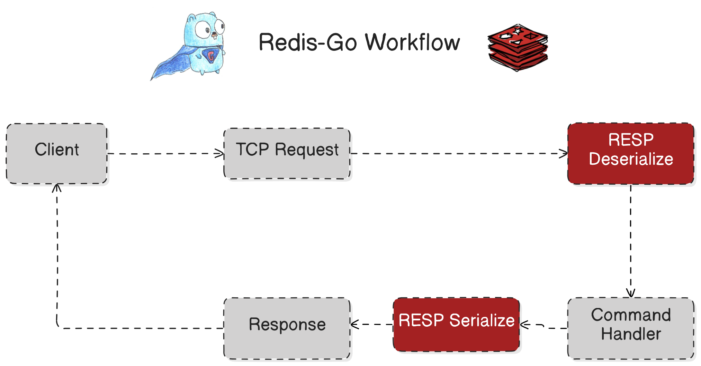
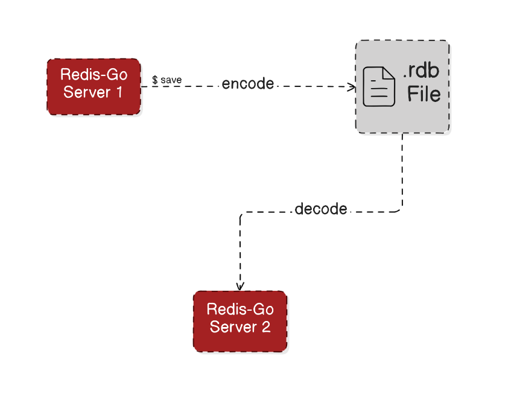

Redis built from scratch in Go.
## Core Features
- **In-memory KEY VALUE store**
- **RESP Protocol**: [Redis Serialization Protocol](https://redis.io/docs/latest/develop/reference/protocol-spec/)
- **Core Commands**: ```GET```, ```SET```, ```ECHO```, and ```PING```.
- **Passive Expiry**: Redis' passive expiry mechanism, ensuring automatic removal of expired keys upon access.
- **RDB Persistence**: [Redis Database Files](https://rdb.fnordig.de/file_format.html) persistence for data persistence.
- **Handle Concurrent Clients**

## Commands
- ```GET``` get the VALUE using the KEY
- ```SET``` save the KEY VALUE pair data
- ```PING``` to check the health of Redis server
- ```SAVE``` save the in-memory data to .rdb file

## In Progress
- Redis Replication
- Redis Stream
- Redis Transaction
- Redis Pub/Sub

## Source Code


## Workflows
### High Level Workflow


### RDB Persistence Workflow


## Working Demos
### RDB Persistence


### Master-Slave Replication

