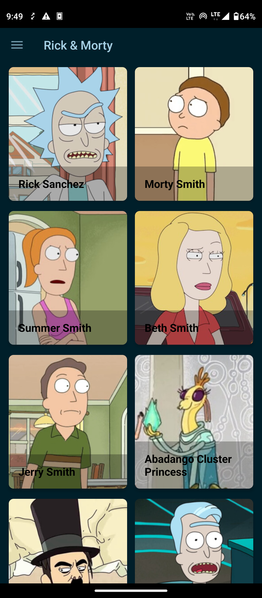
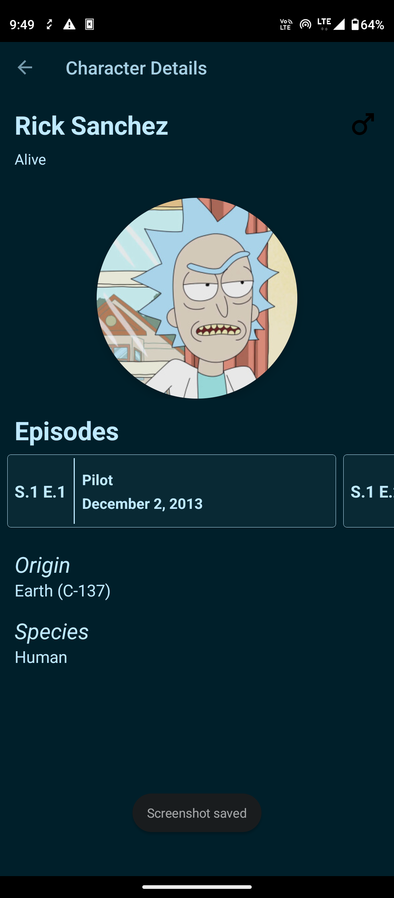
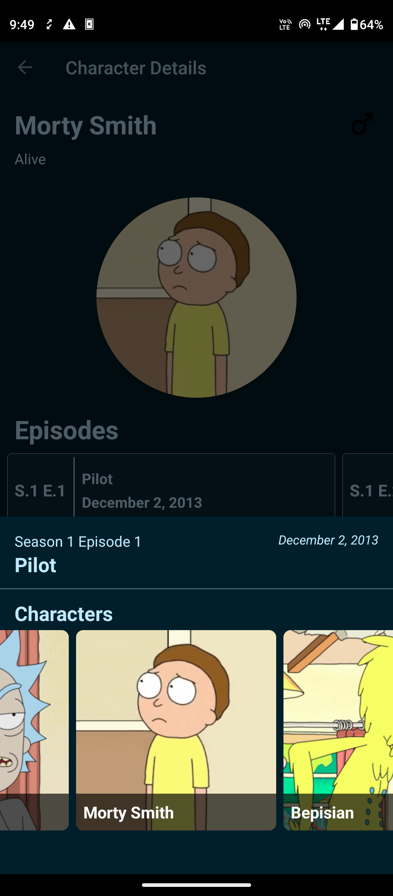
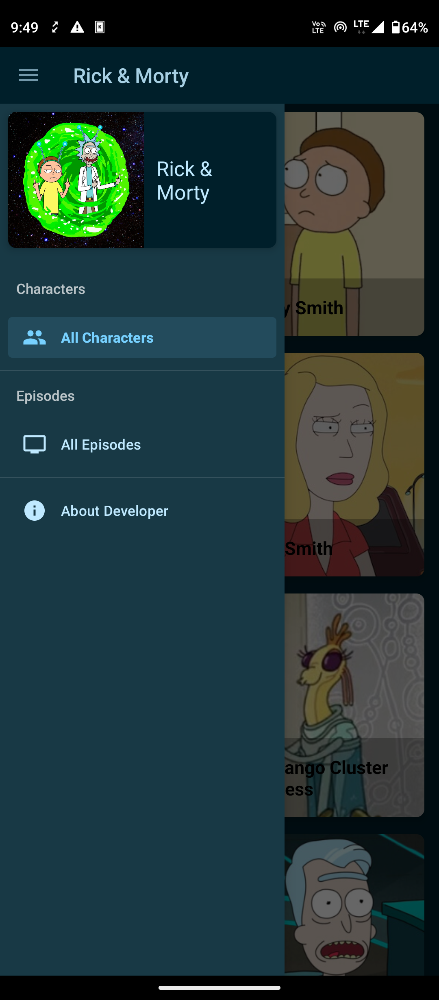
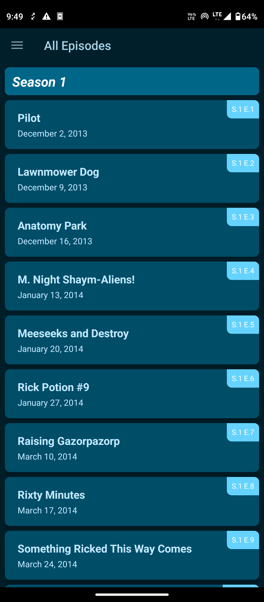
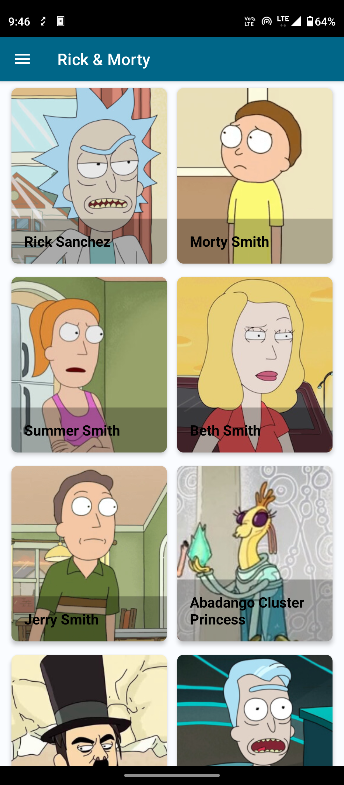
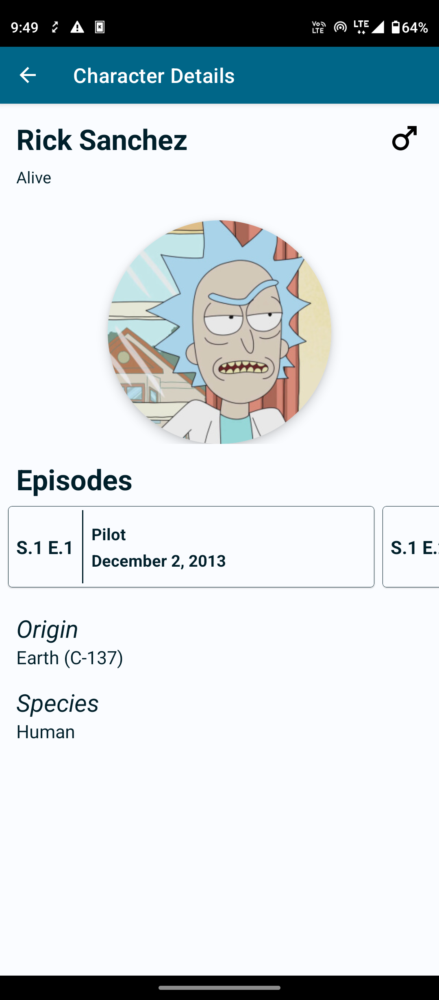
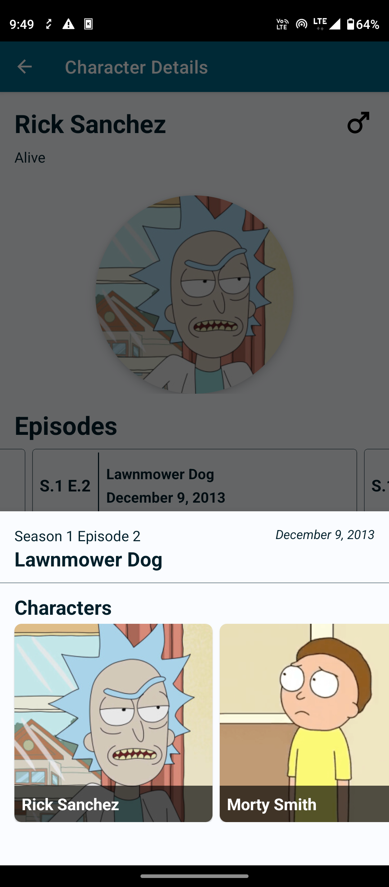
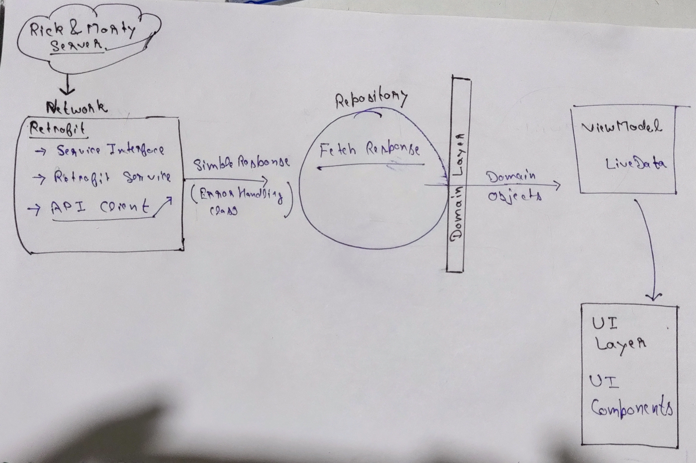


App to browse characters, episodes and search details from Rick & Morty Tv show.




Download app 


#### View source code on Github


--- 
### Gallery

  
  
  
  
  
  
  
  


--- 

### Demo


---

#### Read about its MVVM architecture [here](https://sparrowbit.hashnode.dev/basic-mvvm-android-app).

#### Tech Stack & Libraries
- Kotlin Language
- MVVM Architecture 
- Retrofit
- Picasso
- Epoxy RecyclerView
- Paging 3
- Moshi

#### API
- [The Rick and Morty API](https://rickandmortyapi.com/)

### MVVM Architecture


Start from Network Layer

### 1. **Network Layer**

4 main components are

- Service Interface
    - It define how the app should talk to server
```
interface RickAndMortyService {

    @GET(value = "character/")
    suspend fun getCharactersPage(@Query(value = "page") pageIndex: Int): Response<GetCharactersPageResponse>
}        
```

- Retrofit service
    -  Creates an implementation of the API endpoint defined by our interface and pass that service to our API client.

 ```
 object NetworkLayer {

    val moshi = Moshi.Builder()
        .add(KotlinJsonAdapterFactory())
        .build()

    private val retrofit: Retrofit = Retrofit.Builder()
        .client(getLoggingHttpClient())
        .baseUrl("https://rickandmortyapi.com/api/")
        .addConverterFactory(MoshiConverterFactory.create(moshi))
        .build()

    private val rickAndMortyService: RickAndMortyService by lazy {
        retrofit.create(RickAndMortyService::class.java)
    }

    val apiClient = ApiClient(rickAndMortyService)
}
```

- API Client
    - Through which our app will talk to server.
    - It has the methods to talk to API and return the response inside our Network Error handling

- Network Error handling Class *SimpleResponse*

    A simple kind of wrapper class 

    - It have 3 constructor as a parameter - Status, reponse from API client and exception

    - It has some properties to check weather the response is successfull or failed


### 2. **Repository Layer**

We have 3 repository for fetching Character list( for home screen), Single Charater and Episodes.

```
class CharacterListRepository {
    suspend fun getCharactersPage(pageIndex: Int): GetCharactersPageResponse? {
        val request = NetworkLayer.apiClient.getCharactersPages(pageIndex)

        if (request.failed || !request.isSucceed) {
            return null
        }
        return request.body
    }
}
```

- Sending request to api using Api client 

``` 
val request = NetworkLayer.apiClient.getCharactersPages(pageIndex)
```
then checking the request and return accordingly.

### Paging 3 

...

### ViewModel 

...

### UI
...


### Epoxy UI
...


### Data binding
...