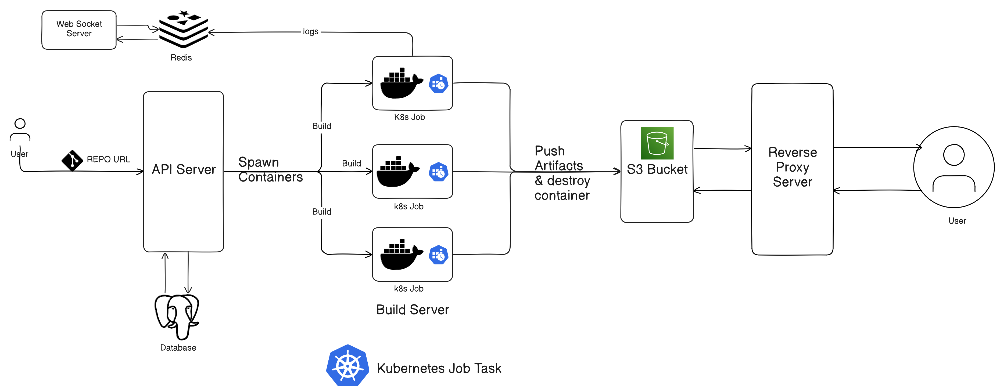

Scale Mesh: A Vercel alternative.

🧑‍💻You can deploy your web applications with just a click.

Features:
1. It dynamically builds and hosts user web apps straight from GitHub repos.
2. View the logs of your deployments.
3. Build & deploy multiple web apps simultaneously from GitHub repos.

## Architecture

## Source Code


There are two Architectures of Scale Mesh
1. Build User's app using AWS ECS.
2. Build User's app using Kubernetes Job.

# ⚙️ Components:
1. Build Server
2. Reverse Proxy API
3. Main API Server
4. Log Collection Pipeline

## 🏗️ Build Server
It builds the code and pushes the artifacts to the S3 bucket.

### 🤔 What it do?
It is a custom Docker container which takes the GitHub repository URL, clones it and build the application artifacts and push to the S3 bucket.

### 🤔 How it works?
It is a docker container built using multi-stage dockerfile, which builds the Go binary in the first stage and then runs the binary in 2nd stage,
this binary contains the code to build the user's web app code and push the build artifacts to the S3 bucket.

> This Docker image is hosted on private AWS ECR.

🔧 Workflow

#### 1. Kubernetes Version
A k8s Job triggered which uses our image from ECR, and create & run the Docker container.

#### 2. Initial version
It uses AWS ECS to run the container as a ECS Task.

### Why run the container as a task?
Task is a short lived process which do the job and destroy the container, so efficient uses of resources and saving the cost.
👉 So, the user can build  & deploy multiple apps simultaneously, and the load will not affect the primary api-server.

## 🙋API Server
The main backend API is the one via which the user interacts with the platform.

🌊Working Flow
➡️User Authentication.
➡️Save the user's web app project info(GitHub repo URL, name) to deploy.
➡️Create single/multiple deployments from the project.
➡️Create the project and Deploy the web app.

## 🧑‍💻Logging Pipeline
The build-Server container pushes the logs to Redis using the pub/sub feature and a web socket server is subscribing to the Redis channel to view the logs.

## Deployment on Kubernetes Cluster
[Scale Mesh is deployed on Kubernetes Cluster.](https://harisheoran.github.io/projects/scale_mesh_deployment/)

## Current Issues:
1. User can start multiple build job task, so it should be handled in Message Queue.
2. No logs database, so need Clickhouse DB.
3. For sending logs in redis pub/sub, we can use Kafka.
