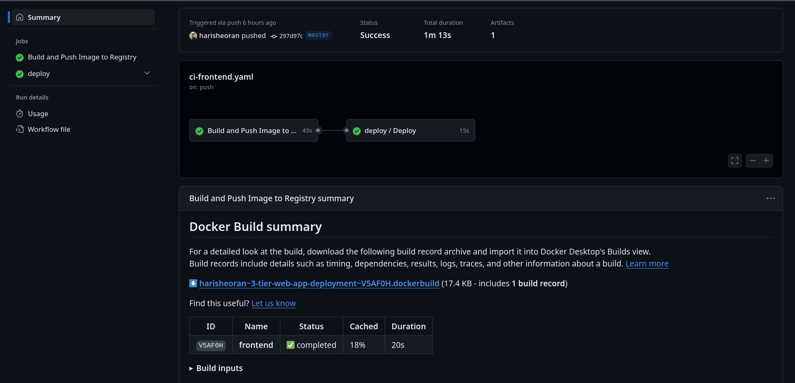

Deploying a three tier web application for production.

> Web application code belongs to this [source](https://github.com/mohammad-taheri1/Book-Store-MERN-Stack)

# Deployment Architecture


# Let's start Deploying in Production
We are going to deploy 3 Tier Web application on AWS in production.

(I used a spare domain)

> Alert!! For Production with security

Tech Stack
- Frontend: React
- Backend: Node JS
- Database MongoDB

We are deploying this web app in a containerized environment with Production strategies.

## Containerization

### Write Backend Dockerfile
We are using Node js in our backend.

> Warning! Do not pass any secret variables at build time, we'll provide them at runtime.

```
FROM node:20.16.0-bookworm-slim

ENV NODE_ENV=production

WORKDIR /app

COPY --chown=node:node package.json .

RUN npm install --only=production

COPY --chown=node:node . .

EXPOSE 8000

USER node

CMD [ "node", "index.js" ]
```

- Use Node JS image with a specific tag in prod, don't use the latest tag, as if the latest tag is new and if a new bug is found in the latest image, it might break your prod.

- We are not using an alpine image, as it contains musl implementation of the C library, if your app's operations need C libraries then it might behave differently, use *booksworm* image with slim, it is lightweight.

- use ```ENV NODE_ENV=production```, it'll make install dependencies for prod

- Set a working directory, which will contain our code.

- First, copy only the package JSON file, Why?

    - Docker uses a layering mechanism to build and when we do rebuild the image, it checks the changes in each layer if no changes, it uses the last build layer and decreases the build time and dependencies don't change that much, so we put it first.

- ``` --chown=node:node ``` copy using only a specific user, it won't give root permission, helps in security as root user has all privileges.

- Install production dependencies only, we don't dev dependencies in prod.

- Now, copy all the code to the current directory.

- Assign a new user, by default, it uses the root user which has all privileges so it can cause security issues.

- Start the server, don't use npm run in prod.

### Write Frontend Dockerfile

In frontend we are using react, so we can build files which we can then serve in web server.

> Don't use ```npm run dev``` in production, it's bad practice, instead build the static files and serve.

We are using Multi stage docker Build, In the First stage, we'll build our react app and in 2nd stage, we use those build files and server them in a web server, and in 2nd stage we don't need NodeJS, we copy only build files, it'll reduce our image size significantly.

> Read more on Multi Stage Build on my [blog](https://harisheoran.github.io/devops/multi_stage_docker_go/).

```
FROM node:20.16.0-bookworm-slim AS build

WORKDIR /app

COPY --chown=node:node package.json .

RUN npm install --only=production

ENV PATH /app/node_modules/.bin:$PATH

COPY --chown=node:node . .

RUN npm run build

FROM nginx:1.27.0-alpine3.19 AS prod

COPY --from=build /app/dist /usr/share/nginx/html

RUN rm /etc/nginx/conf.d/default.conf

#COPY ./nginx.conf /etc/nginx/conf.d/default.conf

EXPOSE 3000

ENTRYPOINT ["nginx", "-g", "daemon off;"]
```

- ``` RUN npm run build ``` after Installing prod dependencies, build the react app, in my case, I am using ***vite***.

- In 2nd stage, use the nginx web server alpine image, here this is lightweight and we don't need c libraries, so we can use alpine images.

- Copy all the build files from 1st stage into 2nd stage.

- Remove the default nginx config file, we'll provide our own at runtime.

- Start the nginx server.


> Put unnecessary files that we don't need to run in a container like .git, .gitignore, and local builds in the ```.dockerignore``` file.

## Creating and Starting the Containers.

### Secrets
We are going to pass secrets at runtime, so it won't be available to the end user.

Ways to Pass secrets at runtime.
- ```env_file``` to provide the secret file.
- Volumes: We can use bind mounts volume to mount(kind of sync) to the container directory.

### Networks
Our user needs to access only Fronted, not the database directly, so we are going to use one more security layer by putting our containers in different networks.


We create 2 networks,
- *Frontend Network*: In this Network, we'll run the frontend and backend container.
- *Backend Network*: In this Network, we'll run the backend and database container.

This creates a layer of separation between our frontend and database, and the backend can talk to both the database and frontend, it enhances security.

### Database Docker Compose
Mongo Db container requires 2 secrets, Database username and password, store them in a ```.env``` file, (Don't push it to GitHub, put it in gitignore)

```
 database:
 image: mongo
 ports:
 - "27017:27017"
 env_file:
 - ./env/.env.db
 volumes:
 - my-db:/data/db
 healthcheck:
 test: echo 'db.runCommand("ping").ok' | mongosh localhost:27017/test --quiet
 interval: 3s
 retries: 5
 start_period: 30s
 networks:
 - backend
 deploy:
 restart_policy:
 condition: on-failure
```

- First, Image, ports, env_file.
- Volume to store the database data on the host machine, this creates a volume on the Host machine. Why?
> Containers are ephemeral in nature means they can be destroyed and created, so any data in that container will be lost.
> Using Volumes, we can save that data in the host machine and if the container is destroyed, start the new container with the same volume.


> Warning! Using a database in a container with volumes is not the way for prod, what if the host machine goes down?

- Put a simple health check by pinging the db.
- Put this in the Backend Network.
- Restart policy in case the container crashes.

### Backend Container


```
 backend:
 image: harisheoran/backend_img:master
 ports:
 - "8000:8000"
 env_file:
 - ./env/.env
 depends_on:
 - database
 networks:
 - backend
 - frontend
 deploy:
 restart_policy:
 condition: on-failure
```

- Define image, env file, ports, and networks.
- ```depends_on```This creates an order of starting the containers, so before starting the backend container it'll check if the database container is created and running, this prevents *failure* as if we start the backend with checking db, it won't be connected to a DB, so prevents a failure.

### Frontend Container

```
 frontend:
 image: harisheoran/frontend_img:master
 ports:
 - "3000:3000"
 networks:
 - frontend
 deploy:
 restart_policy:
 condition: on-failure
 volumes:
 - ./nginx/nginx.conf:/etc/nginx/conf.d/nginx.conf:ro
```
- Define image, ports, network
- Mounting secrets using ***Bind Mount Volume*** (It basically syncs the Host directories/files with the Containers, it does not create a volume on the Host like the database Volume.)

- ```ro```defines that files are with *readonly* permissions, which helps in security, if somebody gets access to our container, then they are unable to write this file.

### Define Volume & Networks

```
volumes:
 my-db:

networks:
 frontend:
 driver: bridge
 backend:
 driver: bridge
```

- Define Volume for Database.
- Define Networks, Docker use bridge Networks internally.

## Branch Protection
Use the GitHub branch protection rule to protect the prod branch, in our case,
- Don't push to prod branch directly without raising PR.
- Can't merge before test completions.


> Here my prod branch is *master* branch.

## CI Pipelines
We are using *GitHub Actions* for creating pipelines.


### Pipeline Secrets Management
- Use GitHub Action secrets to store pipeline secrets.

### 1. Code scan Pipeline
We do not want to break our production with base code, so we can test the code before merging to main, so far we don't have Tests for our code, so we scan our code for any vulnerabilities with *codeql*

[view the pipeline](https://github.com/harisheoran/3-tier-web-app-deployment/blob/cicd/.github/workflows/codeql.yml)

### 2. Main Prod CI pipeline
We want to build the code once merged to the *main* branch push the image to the registry and scan the image.

**Steps**
- Define the *triggering event*, in our case, we want to run the pipeline on code merged/push to the main branch
- Define on which OS, we are going to run our jobs.
- Define required Permissions.
- Check out the repo on the machine.
- Setup *buildx* to build the image, this new buildx helps in caching the image also by layer, Our layering strategy will pay off here by reducing our build time.
- Login to the Image registry, we are using Docker Hub. (Save the Login credentials as secret in Github Actions Secrets)
- Extract Metadata and labels to provide tags to the image, in our case, we are using a branch name as a tag, we can also use *tag* or custom tags.
- Build and Push the image using the Dockerfile, here we are also using *GitHub API* for caching for faster builds.
- Scan the Image using trivy.
- Tiggers the CD Pipeline.

> [View Pipelines YAML](https://github.com/harisheoran/3-tier-web-app-deployment/blob/cicd/.github/workflows/ci-backend.yaml) or [All Pipelines files](https://github.com/harisheoran/3-tier-web-app-deployment/tree/cicd/.github/workflows)

### 3. CD Pipeline
> Docker doesn't have a dedicated tool like *Argo* to implement GitFlow

***Steps***
- SSH into the AWS EC2 using an SSH action
    - Generate SSH Keys on your local machine.
    - Copy content of public key to AWS EC2 authorized_keys file.
    - Save content of private key in GitHub actions secret.
    - Save other secrets - Host username, password, ssh port.

- Ran the docker commands to update the containers.
    - Pull the latest Image
    - Run the compose file
    - delete old containers and images.


### Create Infrastructure using Terraform

Crete infra on AWS, see the [code here](https://github.com/harisheoran/3-tier-web-app-deployment/tree/cicd/iac-terraform)

## Set Up Nginx as Reverse Proxy with SSL certificate
- Setup Nginx as a revere proxy
```
server {
 server_name sparrowbit.co;
 location / {
 proxy_pass http://127.0.0.1:3000;
 proxy_set_header Host $host;
 proxy_set_header X-Real-IP $remote_addr;
 proxy_set_header X-Forwarded-For $proxy_add_x_forwarded_for;
 proxy_set_header X-Forwarded-Proto $scheme;
 }
}
```

- Set up DNS records in your Domain provider Dashboard, use *A* record to save the IPv4 address of the ec2 instance.
- Install SSL certificate using Certbot, you can do this using AWS itself, {read my blog](https://harisheoran.github.io/projects/aws_resume/) to do in AWS.


## Main Challenges
- Passing application secrets in React Container at Runtime
  - REASON: Application static files are being served in the Nginx server, and It does not have a Node js environment, so can't load the env secrets.
  - Solution: Don't store any sensitive info in the frontend site, store env in the backend.

- GitHub Actions Caching to reduce build time.
  - Solution:
      - Use buildx to speed up the build process.
      - Use GitHub API cache to use a cache of the previous build process.


## Yet to Implement
- Server config management using Ansible.
- Testing of Prod Infra.
- Orchestration system for scaling.
- Secure VPC + NACL + Nat Gateways + Private Subnets.
- Branching Strategy
- Releasing Pipelines.
- Image Scan Pipeline.
