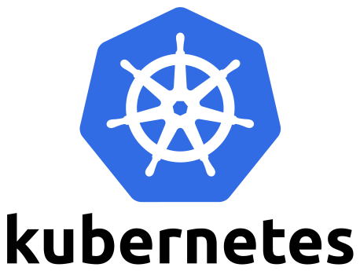
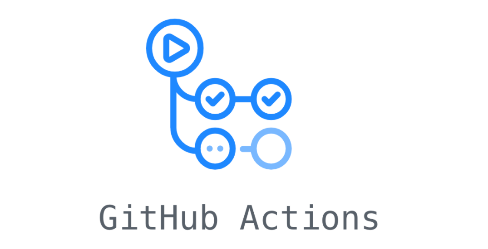

## Resume PDF

View Resume PDF


## About
 I'm Harish, a dedicated practitioner in the field of DevOps, passionate about streamlining development workflows and optimizing infrastructure management. With hands-on experience across a spectrum of technologies including Kubernetes, AWS, Docker, Terraform, Ansible, CICD tools like Jenkins, ArgoCD, GitHub Actions, as well as expertise in Monitoring using Prometheus & Grafana, Linux administration, and version control with Git & GitHub, I bring a comprehensive skill set to every project I undertake. Beyond my professional endeavors, I actively contribute to open source initiatives, driven by a commitment to collaborative innovation.

## Projects

<table>
    <thead>
        <tr>
            <th>Domain</th>
            <th>Skills/Tools</th>
            <th>Project</th>
            <th>Link</th>
        </tr>
    </thead>
    <tbody>
        <tr>
            <td rowspan=4></td>
            <td rowspan=4>AWS EC2, S3, Cloudfront</td>
        </tr>
        <tr>
            <td>Resume Website on AWS S3 with Cloudfront</td>
            <td><a href="https://github.com/harisheoran/AWS-Cloud-Resume" target="_blank">GitHub</a></td>
        </tr>
        <tr>
            <td>Containerized Node.js MongoDB App Deployment on AWS</td>
            <td><a href="https://harisheoran.github.io/projects/containerized_nodejs_mongodb_app_deployment/" target="_blank">GitHub</a></td>
        </tr>
        <tr>
            <td>Hosted an Static website on S3</td>
            <td><a href="https://harisheoran.github.io/projects/terraform_s3/" target="_blank">Link</a></td>
        </tr>  
        <tr>
            <td rowspan=2></td>
            <td rowspan=2></td>
        </tr>
        <tr>
            <td>Kubernetes DevOps Integration </td>
            <td><a href="https://github.com/harisheoran/WebServer-Docker-CI-CD-k8s" target="_blank">GitHub</a></td>
        </tr>
        <tr>
            <td rowspan=3></td>
            <td rowspan=3></td>
        </tr>
        <tr>
            <td>Resume Website API for visitor counter</td>
            <td><a href="https://github.com/harisheoran/AWS-Cloud-Resume/tree/main/counter_api" target="_blank">GitHub</a></td>
        </tr>
        <tr>
            <td>Basic CLI tool to get info from GitHub</td>
            <td><a href="https://github.com/harisheoran/github_info_cli" target="_blank">GitHub</a></td>
        </tr>
        <tr>
            <td rowspan=3></td>
            <td rowspan=3></td>
        </tr>
        <tr>
            <td>Multi-Stage Docker Build of GO web server  </td>
            <td><a href="https://harisheoran.github.io/projects/multi_stage_docker_go/" target="_blank">Link</a></td>
        </tr>
        <tr>
            <td>Containerized an Node JS & Mongo DB web app</td>
            <td><a href="https://github.com/harisheoran/programmer-server" target="_blank">GitHub</a></td>
        </tr>
        <tr>
            <td rowspan=2></td>
            <td rowspan=2></td>
        </tr>
        <tr>
            <td>Install Jenkins on EC2 and configure the web app on EC2</td>
            <td><a href="https://github.com/harisheoran/programmer-server/tree/main/ansible" target="_blank">GitHub</a></td>
        </tr>
        <tr>
            <td rowspan=2></td>
            <td rowspan=2></td>
        </tr>
        <tr>
            <td>Build Docker image & push to Docker Hub registry</td>
            <td><a href="https://github.com/harisheoran/programmer-server/tree/main/jenkins" target="_blank">GitHub</a></td>
        </tr>
        <tr>
            <td rowspan=2></td>
            <td rowspan=2></td>
        </tr>
        <tr>
            <td>Kubernetes DevOps Integration</td>
            <td><a href="https://github.com/harisheoran/WebServer-Docker-CI-CD-k8s/tree/main" target="_blank">GitHub</a></td>
        </tr>
        <tr>
            <td rowspan=2></td>
            <td rowspan=2></td>
        </tr>
        <tr>
            <td>Create Docker image & push to Docker Hub registry</td>
            <td><a href="https://github.com/harisheoran/WebServer-Docker-CI-CD-k8s/blob/main/.github/workflows/dockerhub.yaml" target="_blank">GitHub</a></td>
        </tr>
        <tr>
            <td rowspan=2></td>
            <td rowspan=2></td>
        </tr>
        <tr>
            <td>Created AWS EC2 instance with security groups for a web app deployment</td>
            <td><a href="https://github.com/harisheoran/programmer-server/tree/main/terraform" target="_blank">GitHub</a></td>
        </tr>
    </tbody>
</table>

---

## Opensource Contribution

<table>
    <thead>
        <tr>
            <th>logo</th>
            <th>Skills/Tools Used</th>
            <th>Contribution</th>
            <th>Repository</th>
        </tr>
    </thead>
    <tbody>
        <tr>
            <td rowspan=2></td>
            <td rowspan=2>Go</td>
        </tr>
        <tr>
            <td> bug-fix: network creation process when its already created aka RESUME</td>
            <td><a href="https://github.com/ksctl/ksctl" target="_blank">Github</a></td>
        </tr>
    </tbody>
</table>

